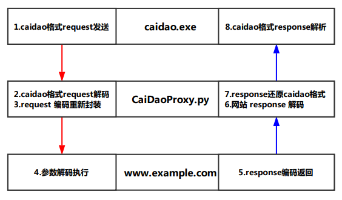
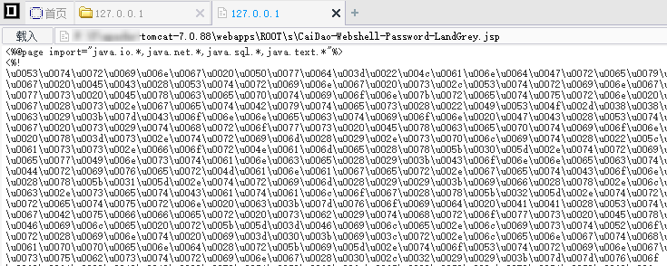
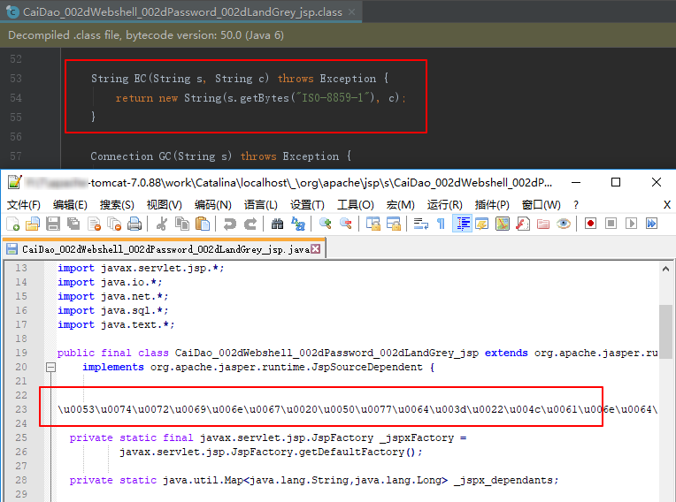
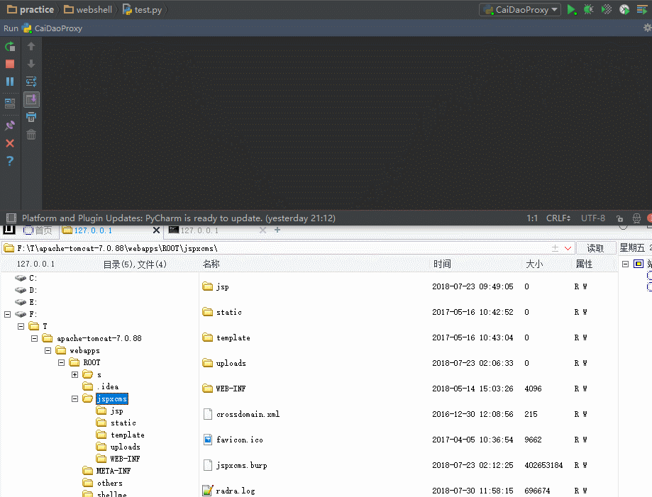

### 0x00：前言

  在实际的渗透测试中，Webshell真正免杀的第一步就是确保 Webshell 的源脚本免杀，其次是传输内容的编码混淆。

  但仅将 request 包内容进行编码，发送到服务器是远远不够的；部分 WAF 或者信息防泄漏系统还会对网页的 response 返回包流量进行检测。这时候，无论源脚本的免杀构造多精巧，request 包编码的多复杂，response 返回的明文内容都会暴露它是一个彻底的 Webshell 脚本。

  目前网络上一些公开客户端，通常仅支持 request 包的自定义编码功能，服务器的代码执行 response 结果通常是明文状态，且无法定义方法进行服务端 response 内容的编码，并最后解码后展示执行结果。

  本篇文章主要分享自己为解决以上问题，根据 caidao.exe，编写普适的本地代理脚本—CaiDaoProxy.py，绕过WAF和流量检测软件对一句话 Webshell 检测的相关思路。

### 0x01：原因

  使用 caidao.exe (20160620 版 **MD5: AC86066FFD58779F4C0DB5030574B0CB**) 进行 CaiDaoProxy.py 的开发大致有以下几个原因：

- 20160620 版本后的 caidao.exe 拥有配置文件，可以直接修改配置文件中发往服务器的语句
- 中间人 Proxy 拦截修改模式对流量的可操作性较强，可随意修改发送包和响应包的任意内容


- 避免为解决中间流量编码混淆等问题重复造轮子，制作 "新型菜刀" 客户端
- 表面用的是普通的 caidao.exe，其实用的是过WAF版的CaiDaoProxy，还是有点意思的


### 0x02：原理

  一言以蔽之：CaiDaoProxy.py 是一个中间人HTTP流量代理脚本。

  它可以在 caidao.exe 发送给目标的 request 内容、目标返回给 caidao.exe 的 response 内容上进行修改，以完成在仅修改菜刀配置文件 caidao.conf 的基础上，结合特定的 Webshell 完成目标到 caidao.exe 之间的流量编码混淆，达到躲过 webshell 流量检测的目的。

  配合基础的免杀源文件，将躲过大部分 Webshell 检测软件和监测平台的 Webshell 发现手段。其实现原理主要如下图所示： 



  可以发现，发送到服务端 www.example.com 的请求是编码混淆过的，服务端的响应也是编码混淆过的。

  对于一些 WAF 和主机流量防护软件来说，原来的caidao 请求特征值**"z0"**、**"z1"**、**"z2"**，分隔符 "**X@Y**"及其它敏感内容(物理路径、执行命令结果等)都无法轻易检测到了。

###  0x03：源文件免杀

  前言中讲了，在有文件的 Webshell 中，源文件免杀是第一步。源文件免杀的php、asp一句话脚本参考我以前写的 [文章](https://github.com/LandGrey/webshell-detect-bypass) 构造起来不算困难。

  但一句话形式的(实际文本内容比较多) JSP Webshell 网络公开讲绕过检测的比较少，所以分享一个比较简单的 JSP Webshell免杀方法—**unicode编码**。

  [这里](https://github.com/LandGrey/webshell-detect-bypass/blob/master/webshell/jsp/CaiDao-Webshell-Password-LandGrey.jsp) 提供一个 caidao.exe 20160620 及以后版本 (默认分隔符: **X@Y**) 可正常连接，源文件免杀的 jsp 一句话示例脚本，密码: `LandGrey`

  原理是 Java 编译器可将 unicode 编码的 java 源代码 (下图所示的 jsp 中的 "**\uxxxx**" 形式的 unicode 编码后的代码) 正常编译成 class文件。



  将提供的 Webshell 放在服务器上，访问后打开 Tomcat 的 work 编译目录，可发现反编译后依然正常的 class 文件和 unicode 编码的 java 源代码文件。



### 0x04：传输内容加密

  这里的**传输内容加密**是指：

> 以服务器的角度来看：客户端发送给它的 request 包中的 POST 参数名和参数值无法轻易知晓其含义；
>
> 并且服务器返回给客户端的 response 包中的内容也无法轻易知晓其含义。

  随着攻防对抗的升级，现在的 Webshell 客户端都有较为原始的"传输内容加密"策略，比如 caidao.exe 默认将发送的部分内容进行一次 base64 编码、16进制转码等，但现在默认的这些小 trick，在躲避检测上起到的作用越来越小，一些防护软件会尝试简单的编码，还原成明文的内容，然后再检测传输内容是否异常。

  限于篇幅，php 、asp等脚本的 CaiDaoProxy.py 实现只介绍其思路，重点说明 jsp 一句话 Webshell 流量加密的 CaiDaoProxy.py 实现方法。

  CaiDaoProxy 的 HTTP 代理功能可使用 Python 的 BaseHTTPServer 基础库完成，默认监听本地一个端口，比如 9000；然后 caidao.exe 地址栏填入 `http://127.0.0.1:9000/?=http://www.example.com/webshell.jsp`，真正请求地址由 CaiDaoProxy 剥离出来即可。

-   对于常见的 php、asp、aspx等一句话 webshell 来说：


1. 可在 caidao.exe 向服务端发送 request 包时，用CaiDaoProxy.py 拦截请求，随机化参数名并组合两种及以上不同的简单编码(如php的 **base64_encode -> strrev-> base64_encode**)，编码参数值来混淆请求流量，然后再发给服务端; 
2. 服务端 Webshell 根据编码方式，解码请求值，并在服务端执行；
3. 可更改 caidao.conf 文件或者在 CaiDaoProxy.py 脚本中统一修改发往服务端执行的代码，将服务端执行的内容输出 `print` 或者 `echo`值进行相应编码；
4. CaiDaoProxy.py 脚本拦截到编码后的服务端输出，根据编码方法，统一解码后返回给 caidao.exe 即可。


-   对于 jsp 一句话 Webshell 来说：主要逻辑都在服务端的 jsp 脚本中，所以我们可以选择基础的对称加密算法 DES 来加密通信流量。然后可约定加解密方法：


1. CaiDaoProxy 发送请求前，进行 **DES加密 -> Base64编码**
2. 服务端接收请求后，进行 **Base64解码 -> DES解密**
3. 服务端输出响应结果时，进行 **DES加密 -> Base64编码**
4. CaiDaoProxy 接收响应后，进行 **Base64解码 -> DES解密**


**服务端关键加解密代码：**

```java
import javax.crypto.Cipher;
import javax.crypto.SecretKey;
import javax.crypto.spec.DESKeySpec;
import javax.crypto.SecretKeyFactory;
import java.security.SecureRandom;

// 密钥
String DesKey = "LandGrey";

// DES 加密函数
byte[] DesEncrpyt(String content) {
  try {
    SecureRandom random = new SecureRandom();
    DESKeySpec desKey = new DESKeySpec(DesKey.getBytes());
    SecretKeyFactory keyFactory = SecretKeyFactory.getInstance("DES");
    SecretKey securekey = keyFactory.generateSecret(desKey);
    Cipher cipher = Cipher.getInstance("DES");
    cipher.init(Cipher.ENCRYPT_MODE, securekey, random);
    return cipher.doFinal(content.getBytes());
  } catch (Throwable e) {
    e.printStackTrace();
  }
  return null;
}

// DES 解密函数
byte[] DesDecrpyt(byte[] content) {
  try {
    SecureRandom random = new SecureRandom();
    DESKeySpec desKey = new DESKeySpec(DesKey.getBytes());
    SecretKeyFactory keyFactory = SecretKeyFactory.getInstance("DES");
    SecretKey securekey = keyFactory.generateSecret(desKey);
    Cipher cipher = Cipher.getInstance("DES");
    cipher.init(Cipher.DECRYPT_MODE, securekey, random);
    return cipher.doFinal(content);
  } catch (Throwable e) {
    e.printStackTrace();
  }
  return null;
}
```

**CaiDaoProxy 关键加解密代码：**

```python
import base64
from pyDes import des, ECB, PAD_PKCS5

// 密钥
DesKey = "LandGrey"

// DES加解密类
class DesCipher:
    def __init__(self, secret_key):
        self.secret_key = secret_key

    def encrypt(self, s):
        iv = self.secret_key
        k = des(self.secret_key, ECB, iv, pad=None, padmode=PAD_PKCS5)
        en = k.encrypt(bytes(s), padmode=PAD_PKCS5)
        return en

    def decrypt(self, s):
        iv = self.secret_key
        k = des(self.secret_key, ECB, iv, pad=None, padmode=PAD_PKCS5)
        de = k.decrypt(s, padmode=PAD_PKCS5)
        return de
```

  然后，就可以参考本文 **0x03：源文件免杀 **的思路，将新的支持流量加解密的 jsp 一句话 Webshell 进行 unicode 编码，一个简单的源文件免杀和通信流量加密的 JSP 一句话 Webshell 就制作完成了。

  CaiDaoProxy.py 使用效果图：



### 0x05：后记

  在编写通用的有文件一句话 Webshell HTTP 代理 CaiDaoProxy 过程中，相当自己又梳理了一遍 caidao.exe 工具的基本原理，对后面更高级的 Webshell Detect Bypass 技术的学习大有裨益。

  虽然这种源脚本和流量都免杀的一句话已经适应较多绕过检测的场景，但当防护软件有进程监控、组件监控或 RASP 功能时，如果使用 caidao.exe 的虚拟终端功能，有极大概率会被检测出来，这也是目前一个比较重要，且需要考虑的 Webshell Bypass 问题。

